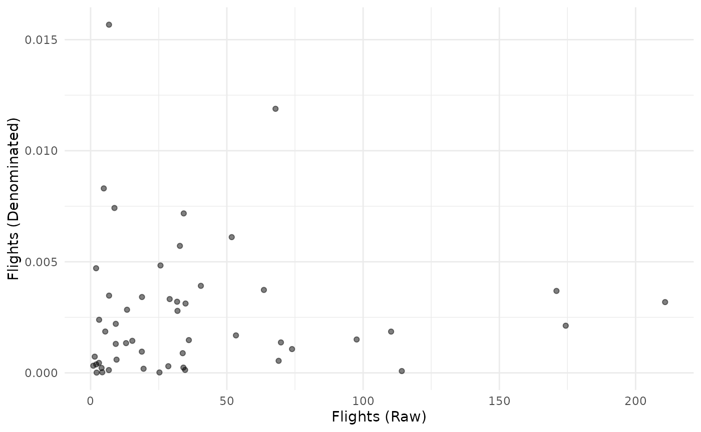

# Denomination

Denomination is the process of scaling one indicator by another quantity
to adjust for the effect of size. This is because many indicators are
linked to the unit’s size (economic size, physical size, population,
etc.) in one way or another, and if no adjustments were made, a
composite indicator would end up with the largest units at the top and
the smallest at the bottom. Often, the adjustment is made by dividing
the indicator by a so-called “denominator” or a denominating variable.
If units are countries, denominators are typically things like GDP,
population or land area.

COINr’s
[`Denominate()`](https://bluefoxr.github.io/COINr/reference/Denominate.md)
function allows to quickly perform this operation in a flexible and
reproducible way. As with other building functions, it is a *generic*
which means that it has different methods for data frames, coins and
purses. They are however all fairly similar.

## Data frames

We’ll begin by demonstrating denomination on a data frame. We’ll use the
in-built data set to get a small sample of indicators:

``` r
library(COINr)

# Get a sample of indicator data (note must be indicators plus a "UnitCode" column)
iData <- ASEM_iData[c("uCode", "Goods", "Flights", "LPI")]
head(iData)
#>   uCode     Goods  Flights      LPI
#> 1   AUT 278.42640 29.01725 4.097985
#> 2   BEL 597.87230 31.88546 4.108538
#> 3   BGR  42.82515  9.23588 2.807685
#> 4   HRV  28.36795  9.24529 3.160829
#> 5   CYP   8.76681  8.75467 2.999061
#> 6   CZE 274.13650 15.30953 3.674309
```

This is the raw indicator data for three indicators, plus the “uCode”
column which identifies each unit. We will also get some data for
denominating the indicators. COINr has an in-built set of denominator
data called `WorldDenoms`:

``` r
head(WorldDenoms)
#>            uName uCode          GDP Population    Area      GDPpc
#> 1    Afghanistan   AFG  19291104008   38041754  652860   507.1034
#> 2        Albania   ALB  15279183290    2854191   27400  5353.2449
#> 3        Algeria   DZA 171091289782   43053054 2381740  3973.9641
#> 4 American Samoa   ASM    636000000      55312     200 11466.6907
#> 5        Andorra   AND   3154057987      77142     470 40886.3912
#> 6         Angola   AGO  88815697793   31825295 1246700  2790.7266
#>          Income_Group
#> 1          Low income
#> 2 Upper middle income
#> 3 Lower middle income
#> 4 Upper middle income
#> 5         High income
#> 6 Lower middle income
```

Now, the main things to specify in denomination are which indicators to
denominate, and by what. In other words, we need to map the indicators
to the denominators. In the example, the export of goods should be
denominated by GDP, passenger flight capacity by population (GDP could
also possibly be reasonable), and “LPI” (the logistics performance
index) is an intensive variable that does not need to be denominated.

This specification is passed to
[`Denominate()`](https://bluefoxr.github.io/COINr/reference/Denominate.md)
using the `denomby` argument. This takes a data frame which includes
“iCode” (the name of the column to be denonimated), “Denominator” (the
column name of the denominator data frame to use), and “ScaleFactor” is
a multiplying factor to apply if needed. We create this data frame here:

``` r
# specify how to denominate
denomby <- data.frame(iCode = c("Goods", "Flights"),
                      Denominator = c("GDP", "Population"),
                      ScaleFactor = c(1, 1000))
```

A second important consideration is that the rows of the indicators and
the denominators need to be matched, so that each unit is denominated by
the value corresponding to that unit, and not another unit. Notice that
the `WorldDenoms` data frame covers more or less all countries in the
world, whereas the sample indicators only cover 51 countries. The
matching is performed inside the
[`Denominate()`](https://bluefoxr.github.io/COINr/reference/Denominate.md)
function, using an identifier column which must be present in both data
frames. Here, our common column is “uCode”, which is already found in
both data frames. This is also the default column name expected by
[`Denominate()`](https://bluefoxr.github.io/COINr/reference/Denominate.md),
so we don’t even need to specify it. If you have other column names, use
the `x_iD` and `denoms_ID` arguments to pass these names to the
function.

Ok so now we are ready to denominate:

``` r
# Denominate one by the other
iData_den <- Denominate(iData, WorldDenoms, denomby)

head(iData_den)
#>   uCode        Goods     Flights      LPI
#> 1   AUT 6.255713e-10 0.003268788 4.097985
#> 2   BEL 1.121507e-09 0.002776498 4.108538
#> 3   BGR 6.246483e-10 0.001323996 2.807685
#> 4   HRV 4.669422e-10 0.002272966 3.160829
#> 5   CYP 3.513901e-10 0.007304232 2.999061
#> 6   CZE 1.093569e-09 0.001434859 3.674309
```

The function has matched each unit in `iData` with its corresponding
denominator value in `WorldDenoms` and divided the former by the latter.
As expected, “Goods” and “Flights” have changed, but “LPI” has not
because it was not included in the `denomby` data frame.

Otherwise, the only other feature to mention is the `f_denom` argument,
which allows other functions to be used other than the division
operator. See the function documentation.

## Coins

Now let’s look at denomination inside a coin. The main difference here
is that the information needed to denominate the indicators may already
be present inside the coin. When creating the coin using
[`new_coin()`](https://bluefoxr.github.io/COINr/reference/new_coin.md),
there is the option to specify denominating variables as part of `iData`
(these are variables where `iMeta$Type = "Denominator"`), and to specify
in `iMeta` the mapping between indicators and denominators, using the
`iMeta$Type` column. To see what this looks like:

``` r
# first few rows of the example iMeta, selected cols
head(ASEM_iMeta[c("iCode", "Denominator")])
#>     iCode Denominator
#> 1     LPI        <NA>
#> 2 Flights  Population
#> 3    Ship        <NA>
#> 4    Bord        Area
#> 5    Elec      Energy
#> 6     Gas      Energy
```

The entries in “Denominator” correspond to column names that are present
in `iData`:

``` r
# see names of example iData
names(ASEM_iData)
#>  [1] "uName"         "uCode"         "GDP_group"     "GDPpc_group"  
#>  [5] "Pop_group"     "EurAsia_group" "Time"          "Area"         
#>  [9] "Energy"        "GDP"           "Population"    "LPI"          
#> [13] "Flights"       "Ship"          "Bord"          "Elec"         
#> [17] "Gas"           "ConSpeed"      "Cov4G"         "Goods"        
#> [21] "Services"      "FDI"           "PRemit"        "ForPort"      
#> [25] "Embs"          "IGOs"          "UNVote"        "CostImpEx"    
#> [29] "Tariff"        "TBTs"          "TIRcon"        "RTAs"         
#> [33] "Visa"          "StMob"         "Research"      "Pat"          
#> [37] "CultServ"      "CultGood"      "Tourist"       "MigStock"     
#> [41] "Lang"          "Renew"         "PrimEner"      "CO2"          
#> [45] "MatCon"        "Forest"        "Poverty"       "Palma"        
#> [49] "TertGrad"      "FreePress"     "TolMin"        "NGOs"         
#> [53] "CPI"           "FemLab"        "WomParl"       "PubDebt"      
#> [57] "PrivDebt"      "GDPGrow"       "RDExp"         "NEET"
```

So in our example, all the information needed to denominate is already
present in the coin - the denominator data, and the mapping. In this
case, to denominate, we simply call:

``` r
# build example coin
coin <- build_example_coin(up_to = "new_coin", quietly = TRUE)

# denominate (here, we only need to say which dset to use)
coin <- Denominate(coin, dset = "Raw")
#> Written data set to .$Data$Denominated
```

If the denomination data and/or mapping isn’t present in the coin, or we
wish to try an alternative specification, we can also pass this to
[`Denominate()`](https://bluefoxr.github.io/COINr/reference/Denominate.md)
using the `denoms` and `denomby` arguments as in the previous section.

This concludes the main features of
[`Denominate()`](https://bluefoxr.github.io/COINr/reference/Denominate.md)
for a coin. Before moving on, consider that denomination needs extra
care because it radically changes the indicator. It is a nonlinear
transformation because each data point is divided by a different value.
To demonstrate, consider the “Flights” indicator that we just
denominated - let’s plot the raw indicator against the denominated
version:

``` r
plot_scatter(coin, dsets = c("Raw", "Denominated"), iCodes = "Flights")
```



This shows that the raw and denominated indicators show very little
resemblance to one another.

## Purses

The final method for
[`Denominate()`](https://bluefoxr.github.io/COINr/reference/Denominate.md)
is for purses. The purse method is exactly the same as the coin method,
except applied to a purse.

An important consideration here is that denominator variables can and do
vary with time, just like indicators. This means that e.g. “Total value
of exports” from 2019 should be divided by GDP from 2019, and not from
another year. In other words, denominators are panel data just like the
indicators.

This is why denominators are ideally input as part of `iData` when
calling
[`new_coin()`](https://bluefoxr.github.io/COINr/reference/new_coin.md).
In doing so, denominators are another column of the data frame like the
indicators, and must have an entry for each unit/time pair. This also
ensures that the unit-matching of denominator and indicator is correct
(or more accurately, I leave that up to you!).

In our example purse, the denominator data is already included, as is
the mapping. This means that denomination is exactly the same operation
as denominating a coin:

``` r
# build example purse
purse <- build_example_purse(up_to = "new_coin", quietly = TRUE)

# denominate using data/specs already included in coin
purse <- Denominate(purse, dset = "Raw")
#> Written data set to .$Data$Denominated
#> Written data set to .$Data$Denominated
#> Written data set to .$Data$Denominated
#> Written data set to .$Data$Denominated
#> Written data set to .$Data$Denominated
```

In fact if you try to pass denominator data to
[`Denominate()`](https://bluefoxr.github.io/COINr/reference/Denominate.md)
for a purse via `denoms`, there is a catch: at the moment, `denoms` does
not support panel data, so it is required to use the same value for each
time point. This is not ideal and may be sorted out in future releases.
For now, it is better to denominate purses by passing all the
specifications via `iData` and `iMeta` when building the purse with
[`new_coin()`](https://bluefoxr.github.io/COINr/reference/new_coin.md).
