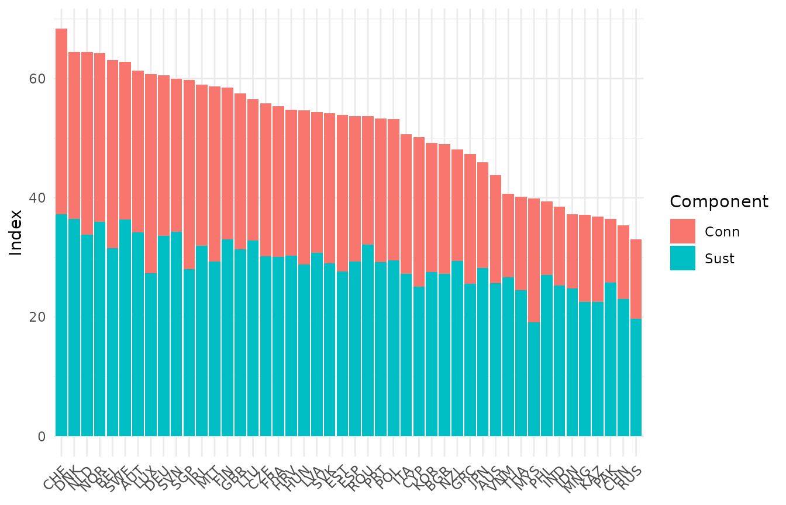

# Overview

## Introduction

This vignette introduces and gives an overview of the **COINr package**.
COINr is a high-level R package which is the first fully-flexible
development and analysis environment for composite indicators and
scoreboards.

This vignette is one of quite a few vignettes which document the
package. Here, the aim is to give a quick introduction and overview of
the package. The other vignettes deal with specific operations.

As of COINr v1.0.0 some radical changes have been introduced. Most
notably for existing users, is the change in syntax. This is an
unfortunate one-off necessity and the changes (and how to survive them,
or roll back to the old version of COINr) are described in an extra
vignette called [Changes in
v1.0](https://bluefoxr.github.io/COINr/articles/v1.md).

## Installation

COINr is on CRAN and can be installed by running:

``` r
install.packages("COINr")
```

Or simply browsing for the package in R Studio. The CRAN version will be
updated every 1-2 months or so. If you want the very latest version in
the meantime (I am usually adding features and fixing bugs as I find
them), you can install the development version from GitHub. First,
install the ‘remotes’ package if you don’t already have it, then run:

``` r
remotes::install_github("bluefoxr/COINr")
```

This should directly install the package from Github, without any other
steps. You may be asked to update packages. This might not be strictly
necessary, so you can also try skipping this step if you prefer.

Once the package is installed, it can be loaded as follows:

``` r
library(COINr)
```

## Features

The main features of the COINr package are those for building the
composite indicator by performing operations on the data, those for
analysing/post-processing, and those for visualisation. Here, the main
functions are briefly listed (this list is not exhaustive):

**Building** functions begin with a capital letter, except for
[`new_coin()`](https://bluefoxr.github.io/COINr/reference/new_coin.md)
which is used to initialise a coin object

| Function                                                                   | Description                                                                                           |
|:---------------------------------------------------------------------------|:------------------------------------------------------------------------------------------------------|
| [`new_coin()`](https://bluefoxr.github.io/COINr/reference/new_coin.md)     | Initialise a coin object given indicator data and metadata                                            |
| [`Screen()`](https://bluefoxr.github.io/COINr/reference/Screen.md)         | Screen units based on data availability rules                                                         |
| [`Denominate()`](https://bluefoxr.github.io/COINr/reference/Denominate.md) | Denominate/scale indicators by other indicators                                                       |
| [`Impute()`](https://bluefoxr.github.io/COINr/reference/Impute.md)         | Impute missing data                                                                                   |
| [`Treat()`](https://bluefoxr.github.io/COINr/reference/Treat.md)           | Treat outliers and skewed distributions                                                               |
| [`qTreat()`](https://bluefoxr.github.io/COINr/reference/qTreat.md)         | Simplified-syntax version of [`Treat()`](https://bluefoxr.github.io/COINr/reference/Treat.md)         |
| [`Normalise()`](https://bluefoxr.github.io/COINr/reference/Normalise.md)   | Normalise indicators onto a common scale                                                              |
| [`qNormalise()`](https://bluefoxr.github.io/COINr/reference/qNormalise.md) | Simplified-syntax version of [`Normalise()`](https://bluefoxr.github.io/COINr/reference/Normalise.md) |
| [`Aggregate()`](https://bluefoxr.github.io/COINr/reference/Aggregate.md)   | Aggregate indicators using weighted mean                                                              |

Building functions are defined as those that modify the data (by
creating an additional data set). They also keep a record of their
arguments inside the coin, which allows coins to be *regenerated*. See
[Adjustments and
Comparisons](https://bluefoxr.github.io/COINr/articles/adjustments.md).

**Analysing** functions include those multivariate analysis, weight
optimisation and sensitivity analysis, as well as those for reporting
results:

| Function                                                                               | Description                                               |
|:---------------------------------------------------------------------------------------|:----------------------------------------------------------|
| [`get_corr()`](https://bluefoxr.github.io/COINr/reference/get_corr.md)                 | Get correlations between any indicator/aggregate sets     |
| [`get_corr_flags()`](https://bluefoxr.github.io/COINr/reference/get_corr_flags.md)     | Find high or low-correlated indicators within groups      |
| [`get_cronbach()`](https://bluefoxr.github.io/COINr/reference/get_cronbach.md)         | Get Cronbach’s alpha for any set of indicators            |
| [`get_data()`](https://bluefoxr.github.io/COINr/reference/get_data.md)                 | Get subsets of indicator data                             |
| [`get_data_avail()`](https://bluefoxr.github.io/COINr/reference/get_data_avail.md)     | Get data availability details of each unit                |
| [`get_denom_corr()`](https://bluefoxr.github.io/COINr/reference/get_denom_corr.md)     | Get high correlations between indicators and denominators |
| [`get_eff_weights()`](https://bluefoxr.github.io/COINr/reference/get_eff_weights.md)   | Get effective weights at index level                      |
| [`get_opt_weights()`](https://bluefoxr.github.io/COINr/reference/get_opt_weights.md)   | Get optimised weights                                     |
| [`get_results()`](https://bluefoxr.github.io/COINr/reference/get_results.md)           | Get conveniently-arranged results tables                  |
| [`get_sensitivity()`](https://bluefoxr.github.io/COINr/reference/get_sensitivity.md)   | Perform a global uncertainty or sensitivity analysis      |
| [`get_stats()`](https://bluefoxr.github.io/COINr/reference/get_stats.md)               | Get a table of indicator statistics                       |
| [`get_str_weak()`](https://bluefoxr.github.io/COINr/reference/get_str_weak.md)         | Highest and lowest-ranking indicators for a given unit    |
| [`get_unit_summary()`](https://bluefoxr.github.io/COINr/reference/get_unit_summary.md) | Summary of scores and ranks for a given unit              |
| [`remove_elements()`](https://bluefoxr.github.io/COINr/reference/remove_elements.md)   | Test the effect of removing indicators or aggregates      |

**Plotting** functions generate plots using the ggplot2 package:

| Function                                                                               | Description                                               |
|:---------------------------------------------------------------------------------------|:----------------------------------------------------------|
| [`plot_bar()`](https://bluefoxr.github.io/COINr/reference/plot_bar.md)                 | Bar chart of a single indicator or aggregate              |
| [`plot_corr()`](https://bluefoxr.github.io/COINr/reference/plot_corr.md)               | Heat maps of correlations between indicators/aggregates   |
| [`plot_dist()`](https://bluefoxr.github.io/COINr/reference/plot_dist.md)               | Statistical plots of indicator/aggregate distributions    |
| [`plot_dot()`](https://bluefoxr.github.io/COINr/reference/plot_dot.md)                 | Dot plot of an indictaor/aggregate with unit highlighting |
| [`plot_framework()`](https://bluefoxr.github.io/COINr/reference/plot_framework.md)     | Sunburst or linear plot of indicator framework            |
| [`plot_scatter()`](https://bluefoxr.github.io/COINr/reference/plot_scatter.md)         | Scatter plot between two indicators/aggregates            |
| [`plot_sensitivity()`](https://bluefoxr.github.io/COINr/reference/plot_sensitivity.md) | Plots of sensitivity indices                              |
| [`plot_uncertainty()`](https://bluefoxr.github.io/COINr/reference/plot_uncertainty.md) | Plots of confidence intervals on unit ranks               |

**Adjustment and comparison** functions allow copies, adjustments and
comparisons to be made between alternative versions of the composite
indicator:

| Function                                                                                     | Description                                                                         |
|:---------------------------------------------------------------------------------------------|:------------------------------------------------------------------------------------|
| [`Regen()`](https://bluefoxr.github.io/COINr/reference/Regen.md)                             | Regenerate results of a coin object                                                 |
| [`change_ind()`](https://bluefoxr.github.io/COINr/reference/change_ind.md)                   | Add and remove indicators                                                           |
| [`compare_coins()`](https://bluefoxr.github.io/COINr/reference/compare_coins.md)             | Exports all data frames in the COINr object to an Excel workbook                    |
| [`compare_coins_multi()`](https://bluefoxr.github.io/COINr/reference/compare_coins_multi.md) | Convert a COINr class object to a COIN class object, for use in the ‘COINr’ package |

**Other functions** are useful tools that don’t fit into the other
categories

| Function                                                                                     | Description                                                         |
|:---------------------------------------------------------------------------------------------|:--------------------------------------------------------------------|
| [`import_coin_tool()`](https://bluefoxr.github.io/COINr/reference/import_COIN_tool.md)       | Import data and metadata from the COIN Tool                         |
| [`COIN_to_coin()`](https://bluefoxr.github.io/COINr/reference/COIN_to_coin.md)               | Convert an older “COIN” class object to a newer “coin” class object |
| [`build_example_coin()`](https://bluefoxr.github.io/COINr/reference/build_example_coin.md)   | Build the example coin using built-in example data                  |
| [`build_example_purse()`](https://bluefoxr.github.io/COINr/reference/build_example_purse.md) | Build the example purse using built-in example data                 |
| [`export_to_excel()`](https://bluefoxr.github.io/COINr/reference/export_to_excel.md)         | Export contents of the coin to Excel                                |

All functions are fully documented and individual function help can be
accessed in the usual way by `?function_name`.

The COINr package is loosely object oriented, in the sense that the
composite indicator is encapsulated in an S3 class object called a
“coin”, and a time-indexed collection of coins is called a “purse” (see
[Building coins](https://bluefoxr.github.io/COINr/articles/coins.md))
Most of the main functions listed in the previous tables take this
“coin” class as the main input (and often also as the output) with other
function arguments specifying how to apply the function. E.g. the syntax
is typically:

``` r
coin <- COINr_function(coin, function_arguments)
```

Many of the main COINr functions are *generics*: they have methods also
for data frames, purses, and in some cases numeric vectors. This means
that COINr functions can also be used for ad-hoc operations without
needing to build coins.

## Quick example

The COINr package contains some example data which is used in most of
the vignettes to demonstrate the functions, and this comes from the
[ASEM Sustainable Connectivity
Portal](https://composite-indicators.jrc.ec.europa.eu/asem-sustainable-connectivity/).
It is a data set of 49 indicators covering 51 Asian and European
countries, measuring “sustainable connectivity”. Here we work through
building a composite indicator, and link to the other vignettes for more
details.

Before proceeding, let’s clearly define a few terms first to avoid
confusion later on.

- An *indicator* is a variable which has an observed value for each
  unit. Indicators might be things like life expectancy, CO2 emissions,
  number of tertiary graduates, and so on.

- A *unit* is one of the entities that you are comparing using
  indicators. Often, units are countries, but they could also be
  regions, universities, individuals or even competing policy options
  (the latter is the realm of multicriteria decision analysis).

We begin by building a new “coin”. To build a coin you need two data
frames which are inputs to the
[`new_coin()`](https://bluefoxr.github.io/COINr/reference/new_coin.md)
function. See the vignette on [Building
coins](https://bluefoxr.github.io/COINr/articles/coins.md) for more
details on this.

``` r
ASEM <- new_coin(ASEM_iData, ASEM_iMeta, level_names = c("Indicator", "Pillar", "Sub-index", "Index"))
#> iData checked and OK.
#> iMeta checked and OK.
#> Written data set to .$Data$Raw
```

The output of
[`new_coin()`](https://bluefoxr.github.io/COINr/reference/new_coin.md)
is a coin class object with a single data set called “Raw”:

``` r
ASEM
#> --------------
#> A coin with...
#> --------------
#> Input:
#>   Units: 51 (AUS, AUT, BEL, ...)
#>   Indicators: 49 (Goods, Services, FDI, ...)
#>   Denominators: 4 (Area, Energy, GDP, ...)
#>   Groups: 4 (GDP_group, GDPpc_group, Pop_group, ...)
#> 
#> Structure:
#>   Level 1 Indicator: 49 indicators (FDI, ForPort, Goods, ...) 
#>   Level 2 Pillar: 8 groups (ConEcFin, Instit, P2P, ...) 
#>   Level 3 Sub-index: 2 groups (Conn, Sust) 
#>   Level 4 Index: 1 groups (Index) 
#> 
#> Data sets:
#>   Raw (51 units)
```

Let’s view the structure of the index that we have specified, using the
[`plot_framework()`](https://bluefoxr.github.io/COINr/reference/plot_framework.md)
function:

``` r
plot_framework(ASEM)
```


See the
[Visualisation](https://bluefoxr.github.io/COINr/articles/visualisation.md)
vignette for the full range of plotting options in COINr.

At the moment the coin contains only our raw data. To build the
composite indicator we need to perform operations on the coin. All of
these operations are optional and can be performed in any order. We
begin by *denominating* the raw data: that is, we divide some of the
indicators by other quantities to make our indicators comparable between
small and large countries. See the vignette on
[Denomination](https://bluefoxr.github.io/COINr/articles/denomination.md).

``` r
ASEM <- Denominate(ASEM, dset = "Raw")
#> Written data set to .$Data$Denominated
```

The only thing we specify here is that the denomination should be
performed on the “Raw” data set. The other specifications for how to
denominate the indicators were already contained in the data frames that
we input to
[`new_coin()`](https://bluefoxr.github.io/COINr/reference/new_coin.md).
Running
[`Denominate()`](https://bluefoxr.github.io/COINr/reference/Denominate.md)
has created a new data set called “Denominated” which is reported in the
message when we run the function (we can choose another name if we
wish). This is *additional* to the “Raw” data set and does not overwrite
it.

Next we will screen units (countries) based on data availability. We
want to ensure that every unit (country) has at least 90% data
availability across all indicators. Screening is done by the
[`Screen()`](https://bluefoxr.github.io/COINr/reference/Screen.md)
function:

``` r
ASEM <- Screen(ASEM, dset = "Denominated", dat_thresh = 0.9, unit_screen = "byNA")
#> Written data set to .$Data$Screened
```

The details of this function can be found in the [Unit
screening](https://bluefoxr.github.io/COINr/articles/screening.md)
vignette. Again, by running this function we have created a new data
set. Let’s look again at the contents of the coin using its
[`print()`](https://rdrr.io/r/base/print.html) method:

``` r
ASEM
#> --------------
#> A coin with...
#> --------------
#> Input:
#>   Units: 51 (AUS, AUT, BEL, ...)
#>   Indicators: 49 (Goods, Services, FDI, ...)
#>   Denominators: 4 (Area, Energy, GDP, ...)
#>   Groups: 4 (GDP_group, GDPpc_group, Pop_group, ...)
#> 
#> Structure:
#>   Level 1 Indicator: 49 indicators (FDI, ForPort, Goods, ...) 
#>   Level 2 Pillar: 8 groups (ConEcFin, Instit, P2P, ...) 
#>   Level 3 Sub-index: 2 groups (Conn, Sust) 
#>   Level 4 Index: 1 groups (Index) 
#> 
#> Data sets:
#>   Raw (51 units)
#>   Denominated (51 units)
#>   Screened (46 units)
```

Notice that the “Screened” data set now has 46 units because five have
been screened out, having less than 90% data availability.

Next we will impute any remaining missing data points. This can be done
in a variety of ways, but here we choose to impute using the group mean,
i.e. if a country is in the “Asia” group, we replace missing points by
the Asian mean. If a country is in the “Europe” group, we replace with
the European mean.

``` r
ASEM <- Impute(ASEM, dset = "Screened", f_i = "i_mean_grp", use_group = "EurAsia_group")
#> Written data set to .$Data$Imputed
```

This writes another data set called “Imputed”, which has filled in all
the missing data points. Again, we have to specify which data set to
impute, and we have chosen the “Screened” data set. Full details of the
imputation function can be found in the
[Imputation](https://bluefoxr.github.io/COINr/articles/imputation.md)
vignette.

We would next like to treat any outliers. The
[`Treat()`](https://bluefoxr.github.io/COINr/reference/Treat.md)
function gives a number of options, but by default will identify
outliers using skewness and kurtosis thresholds, then Winsorise or
log-transform indicators until they are brought within the specified
thresholds. This function is slightly complicated and full details can
be found in the [Outlier
treatment](https://bluefoxr.github.io/COINr/articles/treat.md) vignette.

``` r
ASEM <- Treat(ASEM, dset = "Screened")
#> Written data set to .$Data$Treated
```

The details of the data treatment can be found inside the coin. A
simplified version of
[`Treat()`](https://bluefoxr.github.io/COINr/reference/Treat.md) is also
available, called
[`qTreat()`](https://bluefoxr.github.io/COINr/reference/qTreat.md),
which may be easier to use in many cases.

The final step before aggregating is to bring the indicators onto a
common scale by normalising them. The
[`Normalise()`](https://bluefoxr.github.io/COINr/reference/Normalise.md)
function will, by default, scale each indicator onto the
$\lbrack 0,100\rbrack$ interval using a “min-max” approach.

``` r
ASEM <- Normalise(ASEM, dset = "Treated")
#> Written data set to .$Data$Normalised
```

Again, because
[`Normalise()`](https://bluefoxr.github.io/COINr/reference/Normalise.md)
is a slightly complex function (unless it is run at defaults, as above),
a simplified version called
[`qNormalise()`](https://bluefoxr.github.io/COINr/reference/qNormalise.md)
is also available. Details on normalisation can be found in the
[Normalisation](https://bluefoxr.github.io/COINr/articles/normalise.md)
vignette.

To conclude the construction of the composite indicator, we must
aggregate the normalised indicators up within their aggregation groups.
In our example, indicators (level 1) are aggregated into “pillars”
(level 2), which are themselves aggregated up into “sub-indexes” (level
3), which are finally aggregated into a single index (level 4). The
[`Aggregate()`](https://bluefoxr.github.io/COINr/reference/Aggregate.md)
function will aggregate following the structure which was specified in
the `iMeta` argument to
[`new_coin()`](https://bluefoxr.github.io/COINr/reference/new_coin.md).
By default, this is done using the arithmetic mean, and using weights
which were also specified in `iMeta`.

``` r
ASEM <- Aggregate(ASEM, dset = "Normalised", f_ag = "a_amean")
#> Written data set to .$Data$Aggregated
```

Details on aggregation can be found in the
[Aggregation](https://bluefoxr.github.io/COINr/articles/aggregate.md)
vignette.

We now have a fully-constructed coin with index scores for each country.
How do we look at the results? One way is the
[`get_results()`](https://bluefoxr.github.io/COINr/reference/get_results.md)
function which extracts a conveniently-arranged table of results:

``` r
# get results table
df_results <- get_results(ASEM, dset = "Aggregated", tab_type = "Aggs")

head(df_results)
#>   uCode Rank Index  Conn  Sust Physical ConEcFin Political Instit   P2P Environ
#> 1   CHE    1 68.33 62.18 74.48    64.37    33.30     73.03  83.32 56.87   78.13
#> 2   DNK    2 64.47 56.05 72.90    50.17    30.52     76.98  71.59 51.01   70.53
#> 3   NLD    3 64.46 61.32 67.60    68.15    45.11     83.49  67.96 41.86   57.14
#> 4   NOR    4 64.23 56.53 71.93    57.45    25.39     78.95  87.10 33.75   71.55
#> 5   BEL    5 63.11 63.02 63.19    71.80    48.65     79.57  71.84 43.27   52.00
#> 6   SWE    6 62.82 52.88 72.77    51.90    23.93     80.10  70.04 38.43   68.34
#>   Social SusEcFin
#> 1  87.63    57.67
#> 2  86.17    61.99
#> 3  86.00    59.65
#> 4  87.04    57.20
#> 5  85.36    52.22
#> 6  86.92    63.04
```

This shows at a glance the top-ranking countries and their scores. See
the [Presenting
Results](https://bluefoxr.github.io/COINr/articles/results.md) vignette
for more ways to generate results tables.

We can also generate a bar chart:

``` r
plot_bar(ASEM, dset = "Aggregated", iCode = "Index", stack_children = TRUE)
#> Warning: `label` cannot be a <ggplot2::element_blank> object.
```



This also shows the underlying sub-index scores.

We will not explore all functions here. As a final useful step, we can
export the entire contents of the coin to Excel if needed:

``` r
# export coin to Excel
export_to_excel(coin, fname = "example_coin_results.xlsx")
```

## Finally

The preceding example covered a number of features of COINr. Features
that were not mentioned can be found in the following vignettes:

- [Weights](https://bluefoxr.github.io/COINr/articles/weights.md)
- [Analysis](https://bluefoxr.github.io/COINr/articles/analysis.md)
- [Sensitivity
  analysis](https://bluefoxr.github.io/COINr/articles/sensitivity.md)
- [Adjustments and
  Comparisons](https://bluefoxr.github.io/COINr/articles/adjustments.md)
- [Data
  selection](https://bluefoxr.github.io/COINr/articles/data_selection.md)
- [Other
  functions](https://bluefoxr.github.io/COINr/articles/other_functions.md)
