# Visualisation

COINr has a number of options for plotting and visualising indicator
data, both for analysis and presentation. All plots generated by COINr
are powered by ggplot2, which means that if you want to customise them
beyond the arguments provided by COINr functions, you can simply edit
them with ggplot2 commands.

Note that prior to COINr v1.0.0, COINr additionally included interactive
visualisation using apps and HTML widgets. This has been discontinued
but those functions can still be accessed via the COINr6 package. See
the [vignette](https://bluefoxr.github.io/COINr/articles/v1.md) on this
topic for the reasons behind this and further details.

## Framework

Upon building a coin (see the [Building
coins](https://bluefoxr.github.io/COINr/articles/coins.md) vignette), a
good way to begin is to check the structure of the index. This can be
done visually with the
[`plot_framework()`](https://bluefoxr.github.io/COINr/reference/plot_framework.md)
function, which generates a sunburst plot of the index structure.

``` r
library(COINr)

# assemble example COIN
coin <- build_example_coin(up_to = "new_coin")

# plot framework
plot_framework(coin)
```

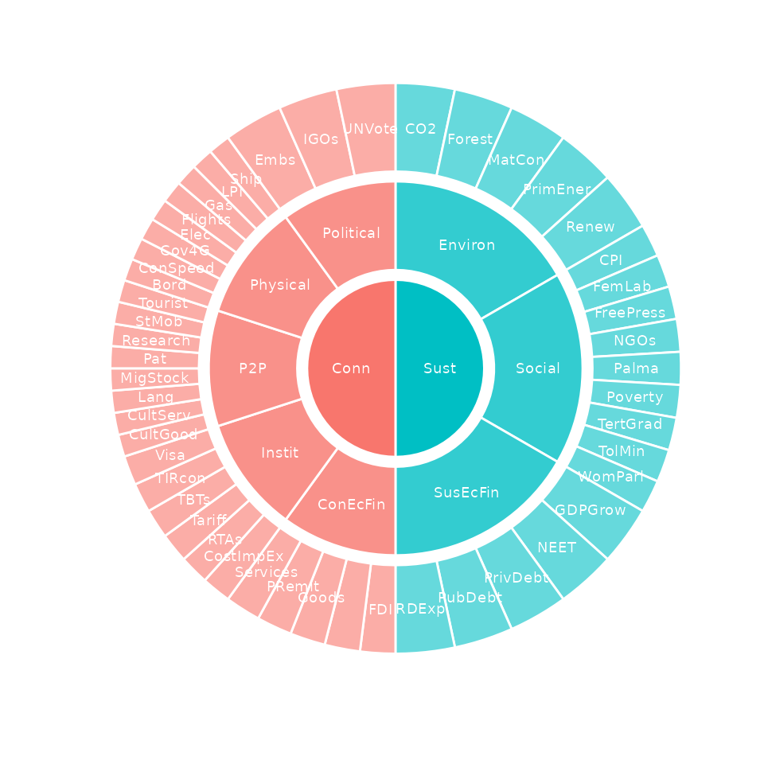

The sunburst plot is useful for a few things. First, it shows the
structure that COINr has understood. This allows you to check whether
the structure agrees with your expectations.

Second, it shows the effective weight of each indicator. Effective
weights are the final weights of each indicator in the index, as a
result of the indicator weights, the parent aggregate weights, and the
structure of the index. This can reveal which indicators are implicitly
weighted more than others, by e.g. having more or less indicators in the
same aggregation groups. The effective weights can also be accessed
directly using the
[`get_eff_weights()`](https://bluefoxr.github.io/COINr/reference/get_eff_weights.md)
function.

Finally, it can be a good way to communicate your index structure to
other people.

The
[`plot_framework()`](https://bluefoxr.github.io/COINr/reference/plot_framework.md)
function has a few options for colouring. Other than that, if you don’t
like sunburst plots, another possibility is to set `type = "stack"`:

``` r
plot_framework(coin, type = "stack", colour_level = 2)
```

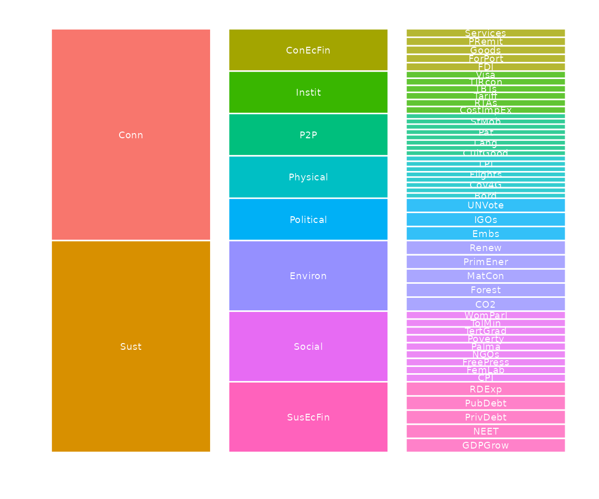

This gives a linear representation of the index. Here we have also set
the colouring level to the pillar level (see
[`plot_framework()`](https://bluefoxr.github.io/COINr/reference/plot_framework.md)
documentation). Note that you will probably have to adjust the plot size
to get a good figure.

## Statistical plots

Here we explore options for statistical plots, namely distribution and
correlation plots.

### Distributions

The distribution of any variable, as well as groups of variables, in a
coin can be visualised quickly using the
[`plot_dist()`](https://bluefoxr.github.io/COINr/reference/plot_dist.md)
function. The simplest case is to plot the distribution of a single
indicator.

``` r
plot_dist(coin, dset = "Raw", iCodes = "CO2")
```

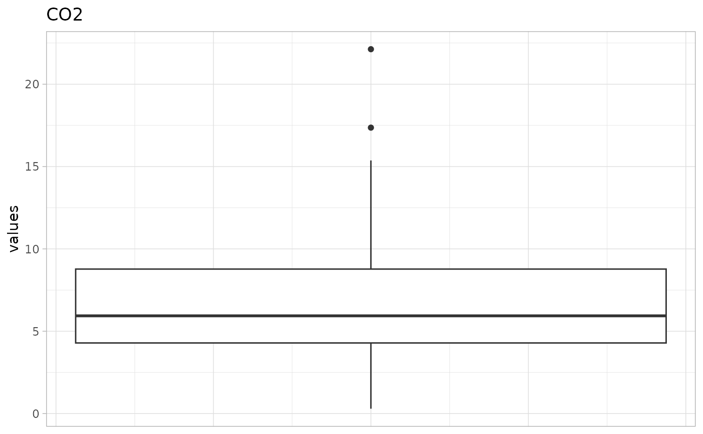

To do this, as usual, we have to specify the data set (`dset`) and the
indicator (`iCodes`) to plot. The data selection for
[`plot_dist()`](https://bluefoxr.github.io/COINr/reference/plot_dist.md)
is powered by
[`get_data()`](https://bluefoxr.github.io/COINr/reference/get_data.md),
which means we can plot subsets of indicator and units. Commonly, with
distribution plots, it might be interesting to plot the distributions of
all indicators belonging to a particular group - let’s plot all
indicator distributions in the “P2P” pillar:

``` r
plot_dist(coin, dset = "Raw", iCodes = "P2P", Level = 1, type = "Violindot")
```

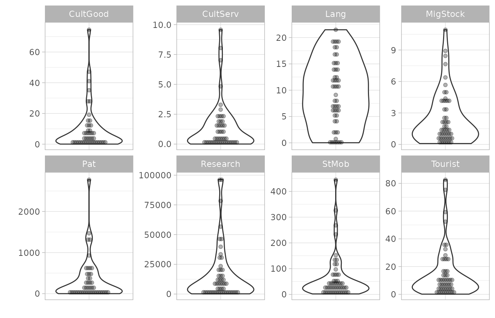

This plots all eight indicators belonging to that group, and we also
specified to plot as “violin-dot” plots. Optionally, data can also be
normalised before plotting using the `normalise` argument. See
[`plot_dist()`](https://bluefoxr.github.io/COINr/reference/plot_dist.md)
for more details and further options.

A similar function,
[`plot_dot()`](https://bluefoxr.github.io/COINr/reference/plot_dot.md)
also plots a single indicator using dots but is rather used for
highlighting individual units rather than as a statistical plot of the
distribution. See [Dot plots](#dot-plots) below.

### Correlations

Correlation plots are very useful for understanding relationships
between indicators. COINr’s
[`plot_corr()`](https://bluefoxr.github.io/COINr/reference/plot_corr.md)
function is a flexible tool for plotting correlations between almost any
variables in a coin, and visualising them according to the structure of
the index.

One thing to keep in mind from the outset is the directionality of your
indicators: if some are negative then this will probably be reflected in
the correlation plots, unless you normalise the data first. With that in
mind, we will build the full example coin including the normalisation
step and then plot some correlations:

``` r
coin <- build_example_coin(quietly = TRUE)
```

Now let’s do a basic plot of correlations within a group:

``` r
plot_corr(coin, dset = "Normalised", iCodes = list("Physical"), Levels = 1)
```

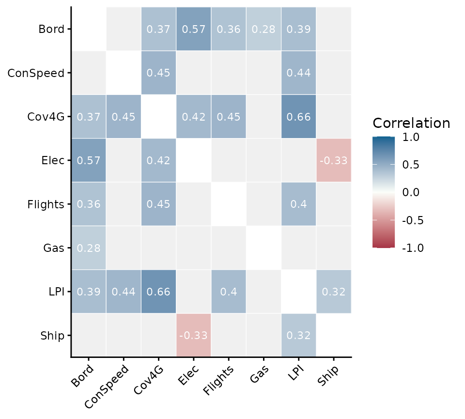

Notice the syntax: we have to specify `iCodes` as a list here, and
specify the level to get data from. In this case we have specified that
we want the indicators (level 1) of the “Physical” group to be
correlated against each other. As usual these arguments are passed to
[`get_data()`](https://bluefoxr.github.io/COINr/reference/get_data.md).

The reason that `iCodes` is specified as a list is that we can pass two
character vectors to it, possibly from different levels:

``` r
plot_corr(coin, dset = "Aggregated",
          iCodes = list(c("Flights", "LPI"), c("Physical", "P2P")), Levels = c(1,2))
```

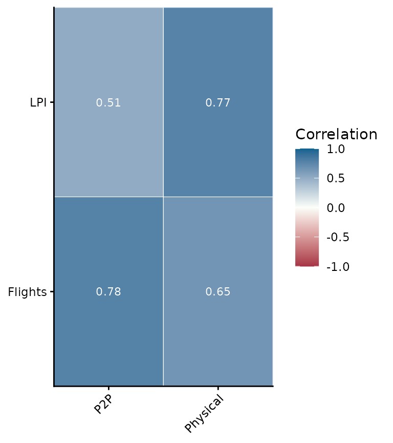

The point being that we can select any set of indicators or aggregates,
and correlate them with any other set. We can also pass further
arguments to
[`get_data()`](https://bluefoxr.github.io/COINr/reference/get_data.md)
such as groupings and unit selection, if needed.

Other useful features include the possibility to correlate a set of
indicators with only its parent groups - this is done by setting
`withparent = "family"`. Here we also set to a discrete colour scheme
using `flagcolours = TRUE`.

``` r
plot_corr(coin, dset = "Aggregated", iCodes = list("Sust"), withparent = "family", flagcolours = T)
```

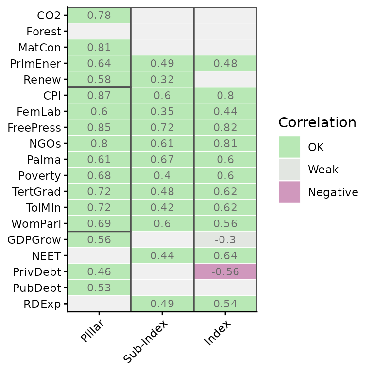

Notice that boxes are drawn around aggregation groups in this case. As a
final example, we show how boxes and groups can be used to show subsets
of correlation matrices. Typically the most interesting correlations are
within aggregation groups because weak correlations cause less
information to be transferred to the aggregate. We can only show
in-group correlations using the `grouplev` argument, which takes an
aggregation level to group indicators at:

``` r
plot_corr(coin, dset = "Normalised", iCodes = list("Sust"),
          grouplev = 2, flagcolours = T)
```

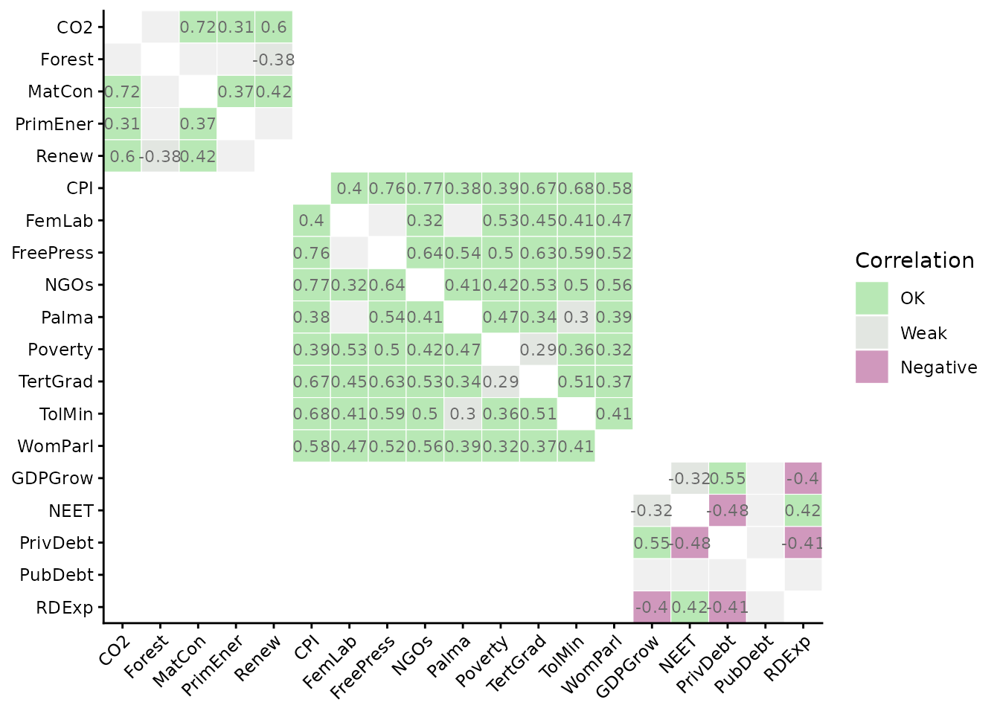

This can also be done with the `box_level` argument, which can be used
additionally to highlight groupings at different levels:

``` r
plot_corr(coin, dset = "Normalised", grouplev = 3, box_level = 2, showvals = F)
```

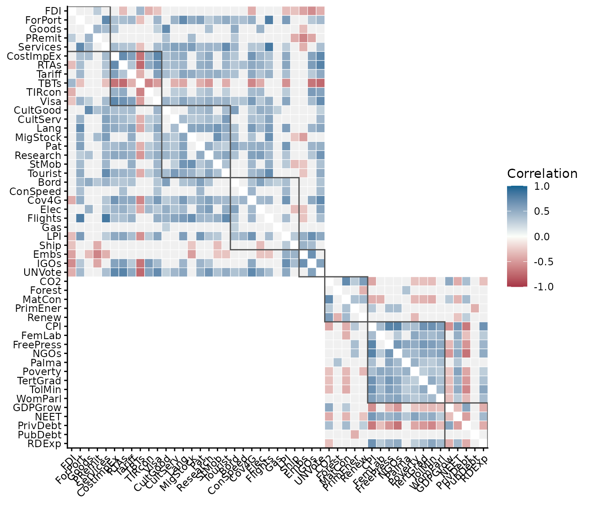

In this case we have also disabled correlation values themselves. Other
options include using different types of correlations, and changing
colours. For details, see the help page of
[`plot_corr()`](https://bluefoxr.github.io/COINr/reference/plot_corr.md).
It is also worth mentioning that underneath,
[`plot_corr()`](https://bluefoxr.github.io/COINr/reference/plot_corr.md)
calls
[`get_corr()`](https://bluefoxr.github.io/COINr/reference/get_corr.md),
so if you are interested in correlation matrices rather than plots, use
that.

## Indicator plots

In this section we examine some options for visualising individual
indicators, in particular with the aim of seeing how different units
compare to one another.

### Bar

A simple way to look at a set of scores for an indicator is with a bar
chart:

``` r
plot_bar(coin, dset = "Raw", iCode = "CO2")
#> Warning: `label` cannot be a <ggplot2::element_blank> object.
```

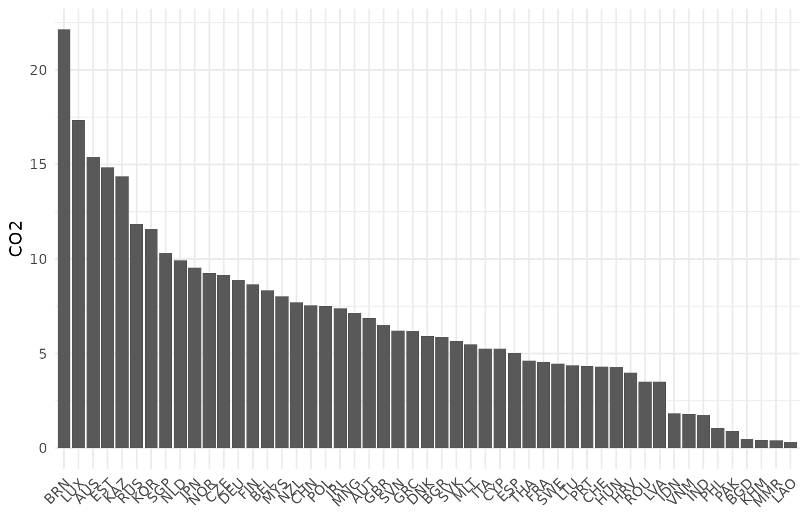

The
[`plot_bar()`](https://bluefoxr.github.io/COINr/reference/plot_bar.md)
function returns a bar chart of single indicator, sorted from high to
low values. We can also colour this by any of the grouping variables
found in the coin

``` r
plot_bar(coin, dset = "Raw", iCode = "CO2", by_group = "GDPpc_group", axes_label = "iName")
#> Warning: `label` cannot be a <ggplot2::element_blank> object.
```

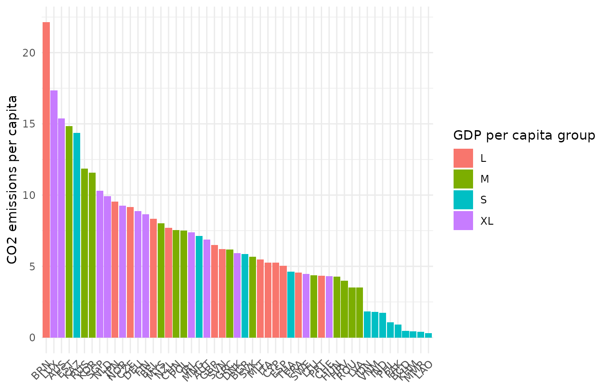

Here we have also set `axes_label = "iName"` to output indicator names
rather than codes. Several other options are available, including a log
scale, and colouring options. Here we just show one more thing, which is
the possibility to break bars down into underlying component scores.
This only works if we are plotting an aggregate score (i.e. level 2 or
higher), rather than an indicator, because it looks for the underlying
scores used to calculate each aggregate score. For example, we can see
how the Sustainability scores break down into their three underlying
components, for each country:

``` r
plot_bar(coin, dset = "Aggregated", iCode = "Sust", stack_children = TRUE)
#> Warning: `label` cannot be a <ggplot2::element_blank> object.
```

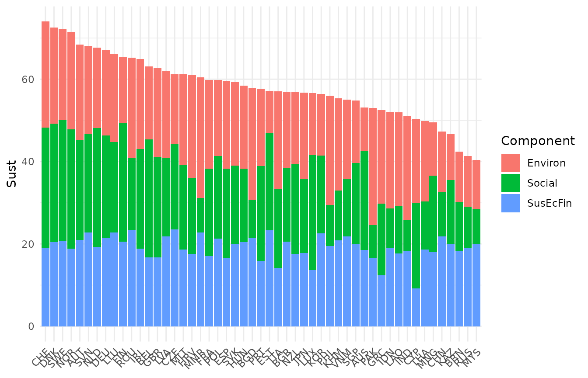

### Dot plots

COINr’s dot plot is pretty similar to a distribution plot but is
intended for showing the position of a particular unit or units relative
to its peers. This means that to make it useful, you should also select
one or more units to highlight.

``` r
plot_dot(coin, dset = "Raw", iCode = "LPI", usel = c("JPN", "ESP"))
```

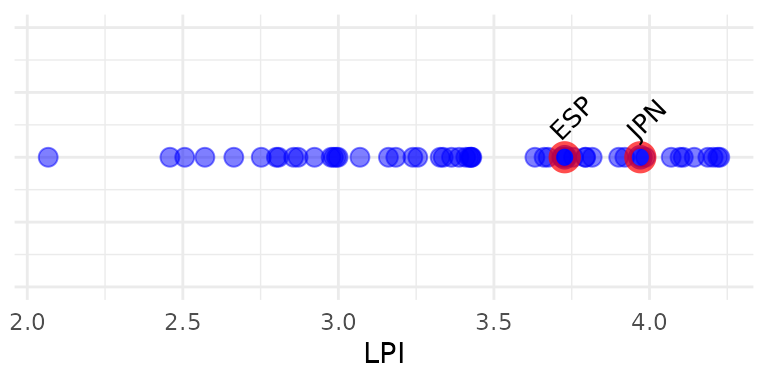

Here we have plotted the “LPI” indicator and highlighted Spain and
Japan. We can also add a statistic of this indicator, such as the
median:

``` r
plot_dot(coin, dset = "Raw", iCode = "LPI", usel = c("JPN", "ESP"), add_stat = "median",
         stat_label = "Median", plabel = "iName+unit")
```

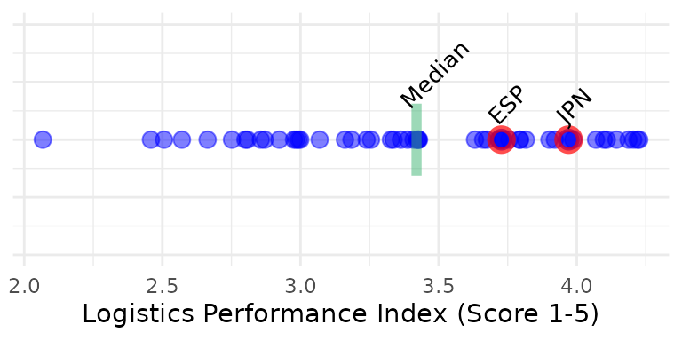

Here we have also labelled the statistic using `stat_label`, and
labelled the x-axis using the indicator name and unit which are taken
from the indicator metadata found within the coin.

### Scatter

The
[`plot_scatter()`](https://bluefoxr.github.io/COINr/reference/plot_scatter.md)
function gives a quick way to plot scatter plots between any indicators
or any variables in a coin.

``` r
plot_scatter(coin, dsets = "Raw", iCodes = c("Goods", "Services"), point_label = "uCode")
```

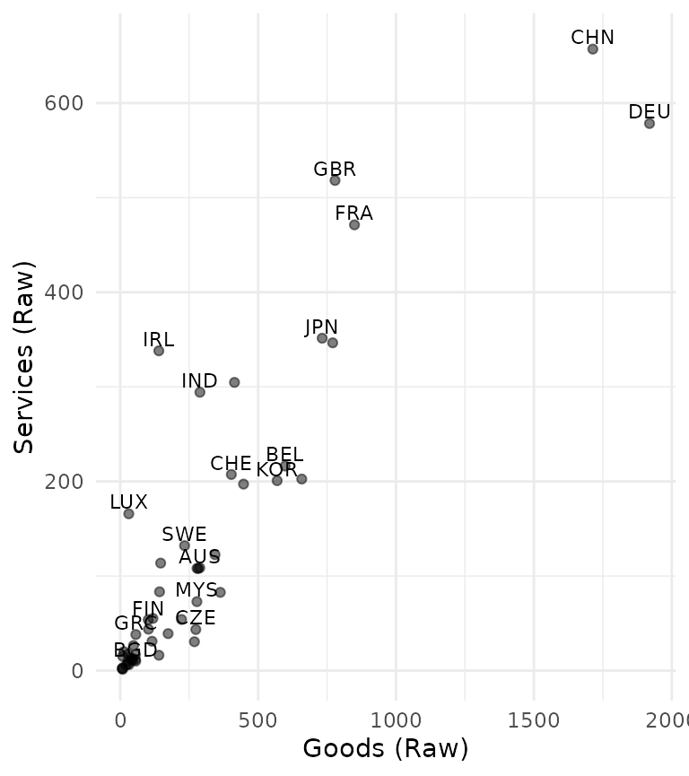

Variables can come from different data sets (including unit metadata),
and we can also colour by groups:

``` r
plot_scatter(coin, dsets = c("uMeta", "Raw"), iCodes = c("Population", "Flights"),
             by_group = "GDPpc_group", log_scale = c(TRUE, FALSE))
```

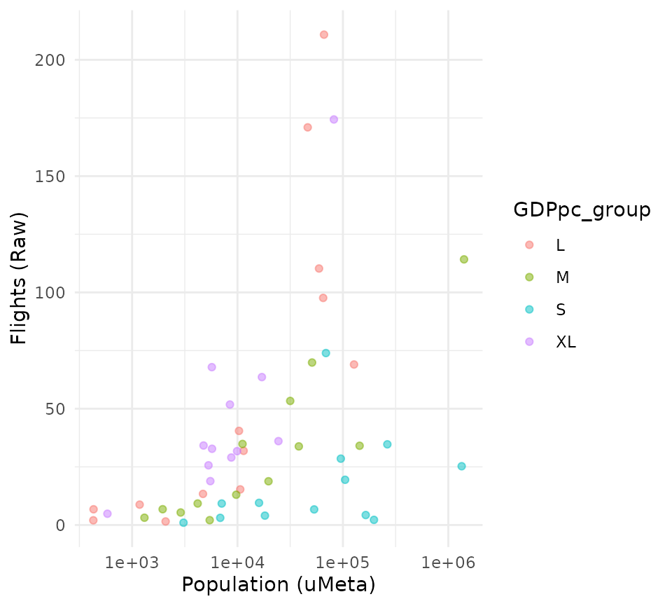

Here we have also converted the x-axis to a log scale since population
is highly skewed. Other options can be found in the help page of
[`plot_scatter()`](https://bluefoxr.github.io/COINr/reference/plot_scatter.md),
and all plots can be further modified using ggplot2 commands.
