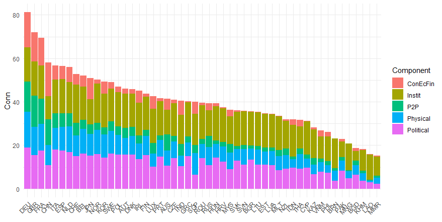

# Summary

Composite indicators are aggregations of indicators that aim to measure complex, multi-dimensional and typically socio-economic concepts such as sustainable development [@HDI2020], innovation [@dutta2020global], globalisation [@becker2021exploring], gender equality [@EM2030] and many more. Composite indicators are very widely used in policy-making and by international organisations, but are equally well-covered in academic literature [@el2019building; @stefana2021composite; @linden2021_weighting]. They are often used to rank and benchmark countries or regions to help direct policy making, but are also frequently used for advocacy [@cobham2015financial].

The construction of a composite indicator includes a number of statistical and data processing steps. The COINr package, introduced in this article, aims to provide a harmonised development environment for composite indicators that includes all common operations from indicator selection, data treatment and imputation up to aggregation, presentation of results and sensitivity analysis. **COINr** enables development, visualisation and exploration of methodological variations, and encourages transparency and reproducibility.

# Statement of need

## Existing tools

Although it is hard to say for sure which tools are mostly used for constructing composite indicators, from the experience of the authors, the majority of CIs are built using Excel, although in some cases the data processing may be done partially or entirely in R, Python or similar.

Some dedicated tools exist however: in Excel, the *COIN Tool* is a spreadsheet-based system which allows users to build and analyse a composite indicator [@COINTool]. In Matlab, there are some packages addressing specific parts of index development: the *CIAO* package uses a nonlinear regression and optimisation approach to tune weights to agree with expert opinions [@CIAOtool]. In R there is an existing package for composite indicator development, called **compind** [@compindPackage]. This has some sophisticated tools for weighting, particularly relating to data envelopment analysis approaches, as well as a number of aggregation functions. However, this is arguably more a toolbox of useful functions for constructing composite indicators, and gives no special consideration to hierarchical structures, uncertainty and sensitivity analysis, and so on.

The Python library *CIF* gives a number of tools for building composite indicators, from loading data to aggregation and visualisation. This is focused in particular on Business Cycle Analysis. Finally, there is a recently launched web-based tool called the *MCDA Index Tool* [@cinelli2021mcda]. This is mostly focused on multi-criteria decision analysis, and doesn't include different levels of aggregation. Nonetheless, for the purposes of MCDA, and certain types of indexes, it is a very useful application.

## Why COINr

**COINr** is a significant step beyond existing composite indicator tools in many respects. COINr wraps all composite indicator data, analysis and methodological choices into a single S3 class object called a "coin". A coin is a structured list including:

* Indicator data sets for each processing step (e.g. imputation, normalisation, etc.)
* Metadata pertaining to indicators and units (e.g. names and weights, but also the hierarchical structure of the index)
* A record of the COINr functions applied in constructing the coin

This enables a neat and structured environment, simplifies the syntax of functions, and also allows comparisons between different versions of the same index, as well as global sensitivity analysis along the lines of [@saisana2005uncertainty] (for the distinction between "local" and "global" sensitivity analysis, see e.g. [@saltelli2019so]). COINr also supports time-indexed (panel) data, represented by the "purse" class (a data frame containing a time-indexed collection of coins). For more information on coins and purses, see the "coins" [vignette](https://bluefoxr.github.io/COINr/articles/coins.html).

All major COINr functions have methods for coins, and many have methods for purses, data frames and numerical vectors. This means that COINr can be used either as an integrated development environment via coins and purses, but equally as a toolbox of functions for other related purposes.

COINr also offers a far wider range of functions and methodological options than any existing package. It not only includes a range of options for treating, imputing, normalising and aggregating indicator data (among others), but also has a suite of analysis tools to check data availability and perform correlation/multivariate analysis. Moreover, it has many options for plotting and visualising data using wrapper functions for **ggplot2**. Many core COINr functions are written with hooks to link with other packages, for example allowing other imputation or aggregation packages to be used with coins.

In short, **COINr** aims to be a flexible, fast and comprehensive development environment for composite indicators. This enables users to develop composite indicators more quickly, more accurately, and encourages reproducibility and transparency.

# Features

**COINr** is extensively documented with many vignettes and examples, all of which can be easily browsed at its **pkgdown** [website](https://bluefoxr.github.io/COINr/). Here, a brief overview is given.

Primarily, COINr is used for building composite indicators: in practice this would usually involve assembling a set of indicators (usually from different sources) and accompanying metadata, and assembling them into a data frame that can be read by COINr to build a "coin" (see [vignette](https://bluefoxr.github.io/COINr/articles/coins.html)). After that, the composite scores are calculated by operating on the coin using any of the "building functions", which specify *which* methodological steps to apply, and *how* to apply them.

The full process of building a composite indicator is too lengthy to describe in this brief paper. Instead, we simply give a very short example. We use the built-in "ASEM" data set which comprises two data frames (one of indicator data, and the other of metadata) that are formatted such that they can be recognised by COINr to build a coin. To build a coin, we call `new_coin()`:

```
# load COINr
library(COINr)

# build a coin with example data set
coin <- new_coin(iData = ASEM_iData, iMeta = ASEM_iMeta)
```

To see how these data frames are formatted, use e.g. `str(ASEM_iData)` or `View(ASEM_iData)` and see the "coins" [vignette](https://bluefoxr.github.io/COINr/articles/coins.html).

In the most simple case, we could build a composite indicator by [normalising](https://bluefoxr.github.io/COINr/articles/normalise.html) the indicators (bringing them onto a common scale), and [aggregating](https://bluefoxr.github.io/COINr/articles/aggregate.html) them (using weighted averages to calculate index scores). This can be done in COINr using the `Normalise()` and `Aggregate()` functions respectively:

```
# normalise (scale) each indicator onto [0, 100] interval
coin <- qNormalise(coin, dset = "Raw", f_n = "n_minmax",
                   f_n_para = list(l_u = c(0, 100)))
                   
# aggregate using weighted arithmetic mean
# (note weights are input in data frames when calling new_coin() )
coin <- Aggregate(coin, dset = "Normalised", f_ag = "a_amean") 
```
Both of these functions allow any other function to be passed to them, allowing more complex types of normalisation and aggregation. Here, we have simply used the "min-max" normalisation method (scaling indicators onto the $$[0, 100]$$ interval), and aggregated using the weighted arithmetic mean. Notice that these COINr functions take coins as inputs, but also have methods for data frames and "purses", among others.

To see the results in a table form, we can call the `get_results()` function:

```
# generate data frame with results at highest aggregation level (index)
get_results(coin, dset = "Aggregated") |>
    head()
    
  uCode Index Rank
1   DEU 75.23    1
2   GBR 68.94    2
3   FRA 65.92    3
4   CHE 62.61    4
5   NLD 61.24    5
6   SWE 60.59    6
```

We may also visualise the same results using a bar chart - here we see how countries rank on the "connectivity" sub-index:

```
plot_bar(coin, dset = "Aggregated", iCode = "Sust", stack_children = TRUE)
```

{width=80%}

As a final example, we show one of the analysis features of COINr: the possibility to plot and analyse correlations:

```
plot_corr(coin, dset = "Normalised", iCodes = list("Sust"),
          grouplev = 2, flagcolours = T)
```

{width=60%}

The correlation plot illustrates where e.g. negative correlations exist within aggregation groups, which may lead to poor representation of indicators in the aggregated scores.

COINr includes far more features than those shown here. Remaining features (with vignette links) include:

**Building features**:

* [Denomination](https://bluefoxr.github.io/COINr/articles/denomination.html) by other indicators
* [Screening](https://bluefoxr.github.io/COINr/articles/screening.html) units by data requirements
* [Imputation](https://bluefoxr.github.io/COINr/articles/imputation.html) of missing data
* [Outlier treatment](https://bluefoxr.github.io/COINr/articles/treat.html) using Winsorisation and nonlinear transformations
* [Weighting](https://bluefoxr.github.io/COINr/articles/weights.html) using either manual weighting, PCA weights or correlation-optimised weights.

**Analysis features:**

* Detailed indicator statistics, data availability, correlation analysis and multivariate analysis (e.g. PCA) - see [Analysis](https://bluefoxr.github.io/COINr/articles/analysis.html) vignette.
* Easy "what if" analysis - very quickly checking the effects of adding and removing indicators, changing weights, methodological variations. See [Adjustments and Comparisons](https://bluefoxr.github.io/COINr/articles/adjustments.html) vignette.
* Global uncertainty and [sensitivity analysis](https://bluefoxr.github.io/COINr/articles/sensitivity.html) which can check the impacts of uncertainties in weighting and many methodological choices

**Visualisation and presentation:**

A number of plotting options are described in the [Visualisation](https://bluefoxr.github.io/COINr/articles/visualisation.html) vignette, including:

* Statistical plots of indicators - histograms, violin plots, dot plots, scatter plots and more
* Bar charts, stacked bar charts and tables for presenting indicator data and making comparisons between units
* Correlation plots for visualising correlations between indicators and between aggregation levels

COINr also allows fast import from the [COIN Tool](https://knowledge4policy.ec.europa.eu/composite-indicators/coin-tool_en) and fast export to Excel.

For the full range of COINr features, see COINr documentation which is conveniently accessible at COINr's [**pkgdown** website](https://bluefoxr.github.io/COINr/index.html).

# Acknowledgements

COINr was initally developed under contract for the European Commission's Joint Research Centre, and this is gratefully acknowledged for enabling the bulk of the initial design.

# References
