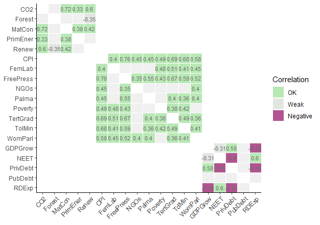

# Summary

Composite indicators (CIs) are aggregations of indicators that aim to measure complex, multi-dimensional and typically socio-economic concepts such as sustainable development [@HDI2020], innovation [@dutta2020global], globalisation [@becker2021exploring], gender equality [@EM2030], and many more. CIs are very widely used in policy-making, by international organisations, and they are equally well-covered in academic literature [@el2019building; @stefana2021composite; @linden2021_weighting]. They are often used to rank and benchmark countries or regions to help direct policy making, but are also frequently used for advocacy [@cobham2015financial].

The *COINr* package, introduced in this article, aims to provide a harmonised development environment for composite indicators that includes all common operations from indicator selection, data treatment and imputation up to aggregation, presentation of results and sensitivity analysis. COINr enables development, visualisation and exploration of methodological variations, and encourages transparency and reproducibility.

# Statement of need

## Existing tools

Some dedicated tools for composite indicators exist: in Microsoft Excel, the *COIN Tool* is a spreadsheet-based system which allows users to build and analyse a composite indicator [@COINTool]. In MATLAB, there are some packages addressing specific parts of index development: the *CIAO* package uses a nonlinear regression and optimisation approach to tune weights to agree with expert opinions [@CIAOtool]. In R [@rstats] there is an existing package for composite indicator development, called *compind* [@compindPackage], focusing on weighting and aggregation, although this is more a toolbox of useful functions for constructing composite indicators, and gives no special consideration to hierarchical structures, uncertainty and sensitivity analysis, and so on.

The Python library *CIF* gives a number of tools for building composite indicators, from loading data to aggregation and visualisation [@cif]. This is focused in particular on Business Cycle Analysis. Finally, there is a recently launched Web-based tool called the *MCDA Index Tool* [@cinelli2021mcda]. This is mostly focused on multi-criteria decision analysis, and doesn't include different levels of aggregation.

## Why COINr

COINr is a significant step beyond existing composite indicator tools in many respects. COINr wraps all composite indicator data, analysis and methodological choices into a single S3 class object called a "coin". A coin is a structured list including:

-   Indicator data sets for each processing step (e.g. imputation and normalisation).
-   Metadata pertaining to indicators and units (e.g. names and weights, but also the hierarchical structure of the index).
-   A record of the COINr functions applied in constructing the coin.

This enables a neat and structured environment, simplifies the syntax of functions, and also allows comparisons between different versions of the same index, as well as global sensitivity analysis along the lines of [@saisana2005uncertainty] (for the distinction between "local" and "global" sensitivity analysis, see e.g. [@saltelli2019so]). COINr also supports time-indexed (panel) data, represented by the "purse" class (a data frame containing a time-indexed collection of coins). For more information on coins and purses, see the "coins" [vignette](https://bluefoxr.github.io/COINr/articles/coins.html).

All major COINr functions have methods for coins, and many have methods for purses, data frames, and numerical vectors. This means that COINr can be used either as an integrated development environment via coins and purses, but equally as a toolbox of functions for other related purposes.

COINr also offers a far wider range of functions and methodological options than any existing package. It not only includes a range of options for treating, imputing, normalising and aggregating indicator data (among others), but also has a suite of analysis tools to check data availability and perform correlation/multivariate analysis. Moreover, it has many options for plotting and visualising data using wrapper functions for the *ggplot2* package [@ggplot2]. Many core COINr functions are written with hooks to link with other packages, for example allowing other imputation or aggregation packages to be used with coins.

# Features

Primarily, COINr is used for *building* composite indicators: In practice this would usually involve assembling a set of indicators (usually from different sources) and accompanying metadata, and assembling them into data frames that can be read by COINr to build a "coin" (see [vignette](https://bluefoxr.github.io/COINr/articles/coins.html)). After that, the composite scores are calculated by operating on the coin using any of the "building functions", which specify the methodological steps to apply, and *how* to apply them.

To give a flavour of COINr, we present a very short example using the built-in "ASEM" data set which comprises two data frames (one of indicator data, and the other of metadata). To build a coin, `new_coin()` function is called:

```R
# load COINr
library(COINr)

# build a coin with example data set
coin <- new_coin(iData = ASEM_iData, iMeta = ASEM_iMeta)
```

To see how these data frames are formatted, one can use e.g. `str(ASEM_iData)` or `View(ASEM_iData)` and see the "coins" [vignette](https://bluefoxr.github.io/COINr/articles/coins.html).

In the most simple case, we could build a composite indicator by [normalising](https://bluefoxr.github.io/COINr/articles/normalise.html) the indicators (bringing them onto a common scale), and [aggregating](https://bluefoxr.github.io/COINr/articles/aggregate.html) them (using weighted averages to calculate index scores). This can be done in COINr using the `Normalise()` and `Aggregate()` functions respectively:

```R
# normalise (scale) each indicator onto [0, 100] interval
coin <- qNormalise(coin, dset = "Raw", f_n = "n_minmax",
                   f_n_para = list(l_u = c(0, 100)))
                   
# aggregate using weighted arithmetic mean
# Note: weights are input in data frames when calling new_coin()
coin <- Aggregate(coin, dset = "Normalised", f_ag = "a_amean") 
```

Both of these functions allow any other function to be passed to them, allowing more complex types of normalisation and aggregation. Here, the code simply uses the "min-max" normalisation method (scaling indicators onto the $[0, 100]$ interval), and aggregated using the weighted arithmetic mean.

To see the results in a table form, one can call the `get_results()` function:

```R
# generate data frame with results at highest aggregation level (index)
get_results(coin, dset = "Aggregated") |> head()
    
  uCode Index Rank
1   DEU 75.23    1
2   GBR 68.94    2
3   FRA 65.92    3
4   CHE 62.61    4
5   NLD 61.24    5
6   SWE 60.59    6
``` 

We may also visualise the same results using a bar chart - here we see how countries rank on the "connectivity" sub-index (see \autoref{fig:bar}).

```R
plot_bar(coin, dset = "Aggregated", iCode = "Conn", stack_children = TRUE)
```


{width="100%"}

As a final example, we show one of the analysis features of COINr: the possibility to plot and analyse correlations.

```R
plot_corr(coin, dset = "Normalised", iCodes = list("Sust"),
          grouplev = 2, flagcolours = T, text_colour = "darkblue")
``` 

{width="100%"}

The correlation plot in \autoref{fig:corr} illustrates where e.g. negative correlations exist within aggregation groups, which may lead to poor representation of indicators in the aggregated scores.

COINr includes far more features than those shown here. Remaining features (with vignette links) include:

**Building:**

-   [Denomination](https://bluefoxr.github.io/COINr/articles/denomination.html) by other indicators
-   [Screening](https://bluefoxr.github.io/COINr/articles/screening.html) units by data requirements
-   [Imputation](https://bluefoxr.github.io/COINr/articles/imputation.html) of missing data
-   [Outlier treatment](https://bluefoxr.github.io/COINr/articles/treat.html) using Winsorisation and nonlinear transformations
-   [Weighting](https://bluefoxr.github.io/COINr/articles/weights.html) using either manual weighting, PCA weights or correlation-optimised weights.

**Analysis:**

-   [Analysis](https://bluefoxr.github.io/COINr/articles/analysis.html) via indicator statistics, data availability, correlation analysis and multivariate analysis (e.g. PCA).
-   [Adjustments and Comparisons](https://bluefoxr.github.io/COINr/articles/adjustments.html): checking the effects of methodological variations.
-   Global uncertainty and [sensitivity analysis](https://bluefoxr.github.io/COINr/articles/sensitivity.html) of the impacts of uncertainties in weighting and many methodological choices

**Others:**

-   A range of [visualisation](https://bluefoxr.github.io/COINr/articles/visualisation.html) options, including statistical plots, bar charts and correlation plots
-   Automatic import from the [COIN Tool](https://knowledge4policy.ec.europa.eu/composite-indicators/coin-tool_en) and fast export to Microsoft Excel.

For the full range of COINr features, see COINr documentation which is accessible at COINr's [website](https://bluefoxr.github.io/COINr/index.html).

# Acknowledgements

COINr was initally developed under contract for the European Commission's Joint Research Centre, and this is gratefully acknowledged for enabling the bulk of the initial design.

# References
