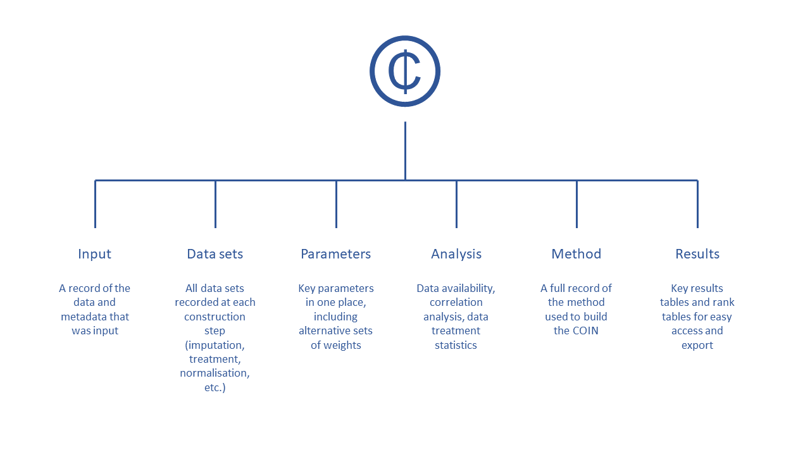
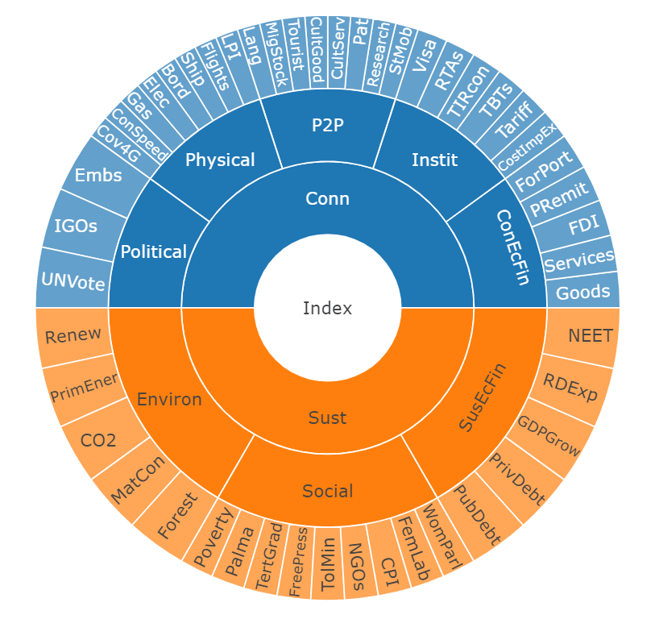
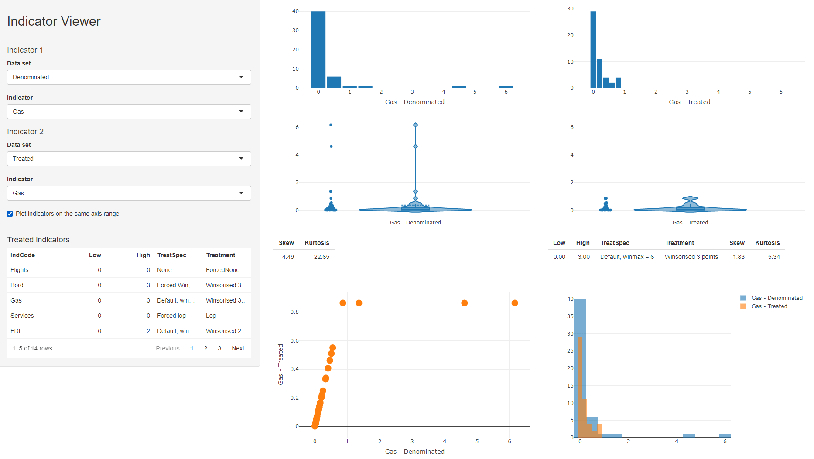
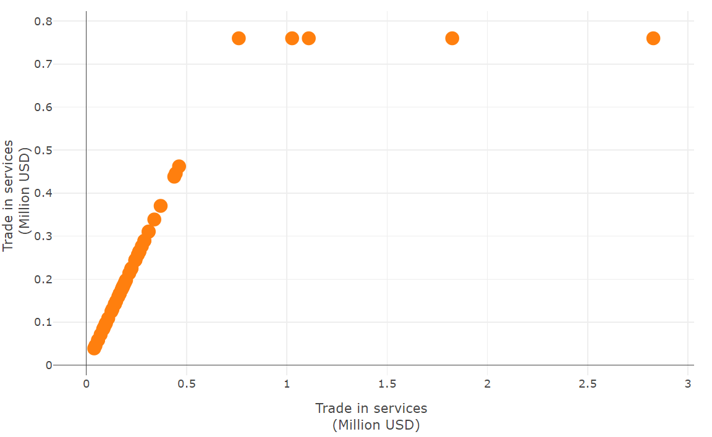
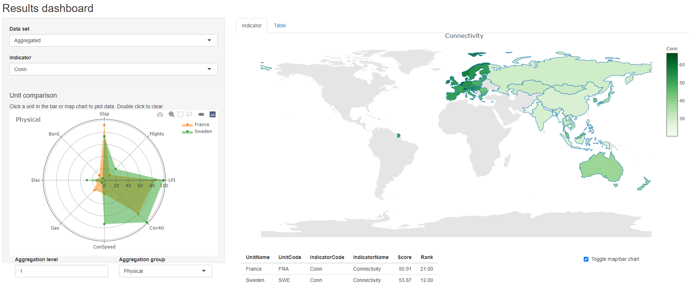
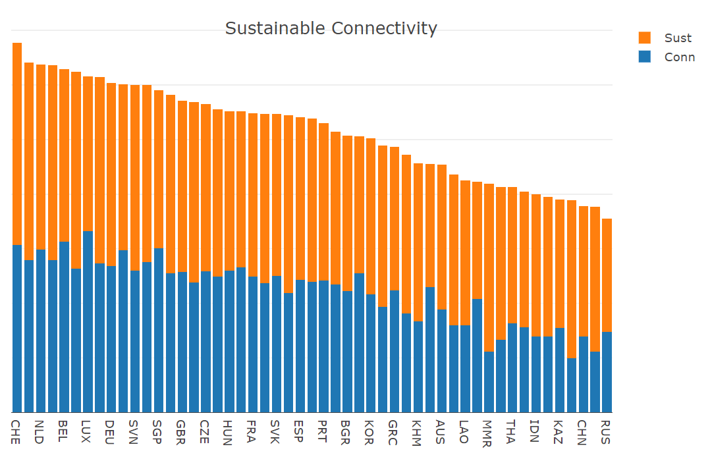
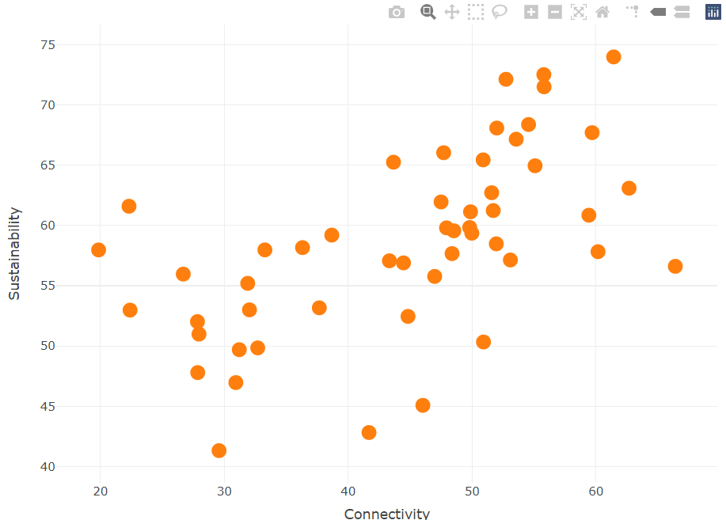
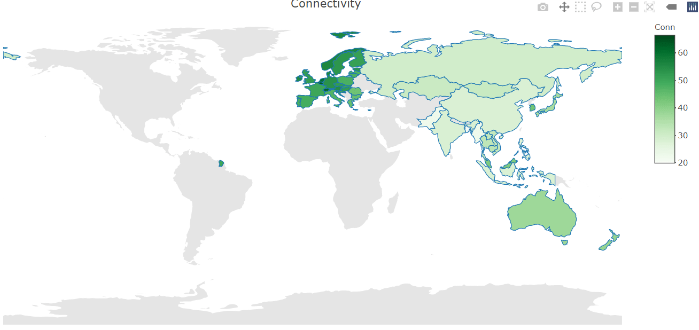
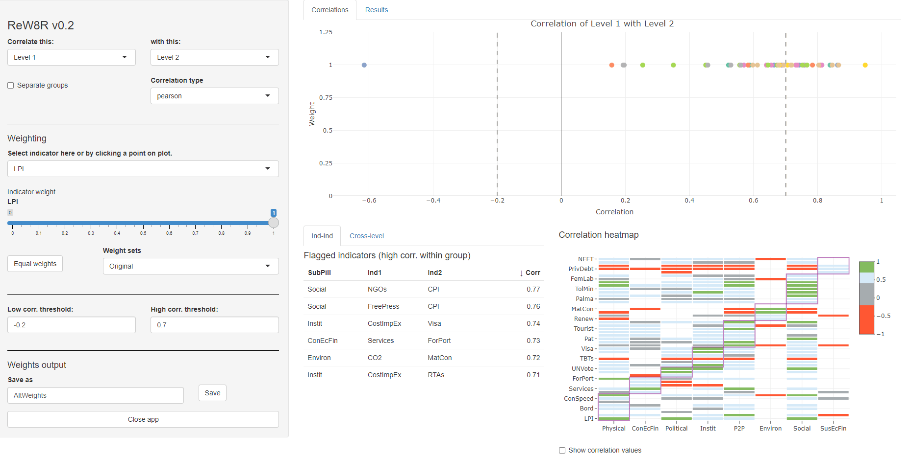

```{r setup, include=FALSE}
knitr::opts_chunk$set(echo = TRUE, fig.align = "center")
```

**NOTES**

This vignette aims to give a general overview of the *COINr* package. An adapted version of this text is currently being prepared for submission to the [Journal of Statistical Software](https://www.jstatsoft.org/index).

Detailed documentation of the *COINr* package is also available at the online book [Composite Indicator Development and Analysis in R with COINr](https://bluefoxr.github.io/COINrDoc/).

Interactive plots in this vignette have been replaced with static images to keep vignette file size as low as possible and to adhere to CRAN policy. Run the commands to see the interactive versions of these plots.

# Introduction

Composite indicators (CIs) are aggregations of indicators which collectively aim to measure a particular concept. The concepts measured by CIs are typically multi-dimensional, socio-economic and difficult to clearly define. Examples include the [Global Innovation Index](https://www.globalinnovationindex.org/Home), the [Asia-Europe Sustainable Connectivity indexes](https://composite-indicators.jrc.ec.europa.eu/asem-sustainable-connectivity/), the [SDG Index and Dashboards](https://dashboards.sdgindex.org/), and many more. A [recent review](https://doi.org/10.1007/s11205-017-1832-9) suggests that the popularity of CIs has grown exponentially over the last 20 years, and a non-exhaustive [survey in 2008](https://www.undp.org/content/dam/undp/library/corporate/Development%20Studies/indices_2008_bandura.pdf) identified nearly 200 national-level composite indicators. The number of existing composite indicators is now likely to be far higher, in the hundreds or even thousands.

Composite indicators are often used to rank and benchmark countries, but are also sometimes [applied to regions](https://doi.org/10.1016/j.indic.2020.100075) or even to [smaller areas](https://doi.org/10.1002/sd.1723). They may also be used to assess [cities](https://composite-indicators.jrc.ec.europa.eu/cultural-creative-cities-monitor), [universities](https://www.timeshighereducation.com/world-university-rankings/2021/world-ranking#!/page/0/length/25/sort_by/rank/sort_order/asc/cols/stats), or even [individuals](https://doi.org/10.3141%2F2434-06).

This vignette introduces a new R package which performs many of the numerical and statistical steps of composite indicator construction and analysis, including visualisation and presentation.

## Constructing composite indicators {#Sec:ContructingCIs}

To begin with, let us define some basic terms The "things" that are being benchmarked/compared by the indicators and composite indicator are more generally referred to as *units*. Units are compared using *indicators*, which are measured variables that are relevant to the overall concept of the composite indicator.

While the concepts measured by composite indicators differ considerably, the underlying methodology is often fairly similar. Typically, it begins by mapping the concept, which leads to selecting relevant indicators. This is followed by an analysis of the indicators, then normalising them onto a common scale, and aggregating them (often in a hierarchical manner) up to a single index value for each unit. Further optional operations can include imputation of missing data, treatment of outliers, multivariate analysis, weighting, and uncertainty/sensitivity analysis. The European Commission's Joint Research Centre summarises the steps for building a composite indicator as follows:

1. Define/map the concept
2. Select the indicators
3. Analyse and treat data
4. Normalise indicators
5. Weight indicators
6. Aggregate indicators
7. Check statistical coherence, multivariate analysis
8. Uncertainty and sensitivity analysis
9. Make sense of the data - compare with other measures and concepts
10. Visualise results and communicate key messages

COINr can partially or fully perform all of these steps except the first, which is a qualitative task.

The first step involves breaking down the concept into sub-dimensions. This is done because the concept being measured is typically multi-dimensional and difficult to clearly define. This vignette will use the *ASEM Sustainable Connectivity* indexes as a case study throughout. In this case, the concept being measured is *sustainable connectivity*. This was mapped into a hierarchical structure as shown here:

```{r ASEMstruct, echo=F, fig.align = 'center', out.width = "100%", fig.cap = "Aggregation structure of the ASEM indexes. Underlying each pillar is a set of indicators."}
knitr::include_graphics("images/ASEM_structure-min.png")
```

One way of looking at this first step is a "deconstruction" of the concept down into more manageable and smaller concepts which can be represented with one or more indicators. The following steps "reconstruct" the concept by working back up. In practice, this reconstruction is done by *aggregating* indicator values, using e.g. weighted averages.

The hierarchical structure of a composite indicator means that it has various "aggregation levels" or "levels" which are often referred to in COINr for accessing, analysing and plotting indicator data. Level 1 always refers to the indicator level (before any aggregation). Level 2 is the first level of aggregation, i.e. aggregate values resulting from aggregating indicators from Level 1. Level 3 results from aggregating values in Level 2, and so on. The ASEM example here has four levels (the indicator level is not shown for reasons of space).

Further construction steps involve indicator selection, based on both qualitative and statistical criteria, followed by a series of mostly statistical/numerical operations which culminate in aggregating the data and presenting it. Along the way it is important to visualise the data and understand indicator properties, distributions and inter-relations. In summary, composite indicator construction is a blend of qualitative conceptual mapping and numerical/statistical steps.

## Existing software

In practice, how are composite indicators actually built? It is hard to give a certain answer to this: although methodological details and source data are sometimes available, it is rare that reproducible code or similar is publicly accessible. From experience, the majority of CIs are built using Excel, although in some cases the data processing may be done partially or entirely in R, Python or similar.

It is easier to outline existing tools and packages available for building composite indicators. In Excel, the [COIN Tool](https://publications.jrc.ec.europa.eu/repository/handle/JRC118407) is a spreadsheet-based system which allows users to build and analyse a composite indicator. It provides indicator statistics, and treats, normalises and aggregates the data with several methodological options along the way, and gives a correlation analysis, among other things. While it has a wide range of features, the drawbacks are that it has limits on the number of indicators and units, and the structure of the index. Moreover, more complex operations such as certain types of multivariate and robustness analysis are not possible. Finally, it runs fairly slowly due to the nature of Excel.

In Matlab, there are some packages addressing specific parts of index development. The [CIAO package](http://dx.doi.org/10.13140/RG.2.2.14335.66729) uses 
a nonlinear regression and optimisation approach to tune weights to agree with expert opinions, accounting for the complexities of correlations. However, this package only deals with weights.

In R there is an existing package for composite indicator development, called [compind](https://cran.r-project.org/package=Compind). This has some sophisticated tools for weighting, particularly relating to data envelopment analysis approaches, as well as a number of aggregation functions. However, this is arguably more a toolbox of useful functions for constructing composite indicators, and gives no special consideration to hierarchical structures, uncertainty and sensitivity analysis, and so on.

In Python there is a library called [CIF](https://github.com/LenkaV/CIF) which gives a number of tools for building composite indicators, from loading data to aggregation and visualisation. This is focused in particular on Business Cycle Analysis.

Finally, there is a recently launched web-based tool called the [MCDA Index Tool](http://www.mcdaindex.net/). This is mostly focused on multi-criteria decision analysis, and doesn't include different levels of aggregation. Nonetheless, for the purposes of MCDA, and certain types of indexes, it is a very useful application.

## Why COINr

*COINr* is a significant step beyond existing composite indicator tools in two main respects. In the first place, it offers a wider range of functions and methodological options than any existing package. It not only includes a range of options for treating, imputing, normalising and aggregating indicator data (among others), but also has a suite of analysis tools to check data availability and perform multivariate analysis. Moreover, it has many options for plotting and visualising data, for static plots (via *ggplot2*), HTML plots (via *plotly*), and includes a data exploration app, a reweighing app and a results presentation app via *shiny*. The features of *COINr* are described in more detail in the following sub-section, and in the rest of this article.

The second major feature of *COINr* is that it wraps all composite indicator data, analysis and methodological choices into a single hierarchical list called a "COIN". COINr functions take a COIN (which is an S3 class), or COINs as an input and often output updated COINs. This enables a neat and structured environment, simplifies the syntax of functions, and also allows comparisons between different versions of the same index, as well as full global sensitivity analysis. This is explained more in [The COIN class].

In short, *COINr* aims to be a flexible, fast and comprehensive development environment for composite indicators. This enables users to develop composite indicators more quickly, more accurately, and encourages reproducibility and transparency.

*COINr* includes many operations which are also available in other packages, such as imputation. *COINr*'s aim is not to provide an exhaustive set of options for each operation, because these are well-covered elsewhere. Rather, it gives a flexible set of choices at each step which should cover most eventualities, inside a harmonised environment which enables a fast and efficient workflow.

## *COINr* features

The main features can be summarised as features for *building*, features for *analysis* and features for *visualisation and presentation*.

**Building features**:

* Flexible and fast development of composite indicators with no limits on aggregation levels, numbers of indicators, highly flexible set of methodological choices.
* Denomination by other indicators (including built in world denominators data set)
* Screening units by data requirements
* Imputation of missing data, by a variety of methods
* Data treatment using Winsorisation and nonlinear transformations
* Normalisation by various methods, either for all indicators or for each individually
* Weighting using either manual weighting, PCA weights or correlation-optimised weights. *COINr* also includes a reweighting app which explores the effects of weights on correlations.
* Aggregation of indicators using a variety of methods which can be different for each aggregation level.

**Analysis features:**

* Detailed indicator statistics, and data availability within aggregation groups
* Multivariate analysis, including quick functions for PCA, and detailed correlation analysis and visualisation
* Easy "what if" analysis - very quickly checking the effects of adding and removing indicators, changing weights, methodological variations
* Full variance-based global uncertainty and sensitivity analysis which can check the impacts of uncertainties in weighting and many methodological choices

**Visualisation and presentation:**

* Statistical plots of indicators - histograms, violin plots, dot plots, scatter plots and more, including interactive HTML plots and an app for exploring indicator data
* Bar charts, stacked bar charts, maps, tables and radar charts for presenting indicator data and making comparisons between units
* Static and interactive correlation plots for visualising correlations between indicators and between aggregation levels
* An interactive app for visualising and presenting initial results
* Automatic generation of unit reports (e.g. country reports) using customisable R markdown templates

*COINr* also allows fast import from the [COIN Tool](https://publications.jrc.ec.europa.eu/repository/handle/JRC118407) and export of all data, analysis and results to Excel in a single command.

*COINr* comes pre-packaged with example data. The example data regards the [ASEM Sustainable Connectivity Indexes](https://composite-indicators.jrc.ec.europa.eu/asem-sustainable-connectivity/), which are indexes constructed to measure *sustainable connectivity* (international connections between countries that contribute to sustainable development). This data will be used to illustrate the features of *COINr* in this vignette.

Overall, this vignette aims to give an overview of the features of *COINr*, without going into fine detail about each due to space limitations. More detailed documentation is however available at an [online book about COINr](https://bluefoxr.github.io/COINrDoc/) and also by browsing the help file of each *COINr* function.

For clarity, where *COINr* functions are used, they are explicitly labelled using the `COINr::function_name` syntax, to help show which functions are native to COINr.

# The COIN class

*COINr* functions are designed to work in particular on an object class called a "COIN". To introduce this, consider what constitutes a composite indicator. In our opinion, it includes at least:

* The indicator data
* Indicator metadata, including weights and directions
* A structure which maps indicators into groups for aggregation, typically over multiple levels
* Methodological specifications, including
    - Data treatment
    - Normalisation method and parameters
    - Aggregation method and parameters
* Processed data sets at each stage of the construction
* Resulting aggregated scores and ranks

Meanwhile, in the process of building a composite indicator, a series of analysis data is generated, including information on data availability, statistics on individual indicators, correlations and information about data treatment.

If a composite indicator is built from scratch, it is easy to generate an environment with dozens of variables and parameters. In case an alternative version of the composite indicator is built, multiple sets of variables may need to be generated. With this in mind, it makes sense to structure all the ingredients of composite indicator, from input data, to methodology and results, into a single object, which is called a *COIN* in *COINr*.

A COIN is a hierarchical list (a list of lists) which has been assigned an S3 class label of a "COIN". Before explaining how a COIN is actually constructed, it is useful to see what it looks like. To see an example, call *COINr*'s built in demo function:

```{r, message=F, warning=F}
library(COINr)
ASEM <- COINr::build_ASEM()
print(class(ASEM))
```

## Inside a COIN

The COIN is best explored using e.g. `View(ASEM)` in R Studio. Here, its structure is summarised in the following graphic. 

```{r COINdiag, echo=F, fig.align = 'center', out.width = "100%", fig.cap = "Inside a COIN"}

```

It consists of six main sub-lists which are briefly described as follows:

* `.$Input` is all input data and metadata that was initially used to construct the COIN.
* `.$Data` consists of data frames of indicator data at each construction step, e.g. `.$Data$Raw` is the raw data used to construct the COIN, `.$Data$Normalised` is the same data set after normalisation, and so on.
* `.$Parameters` contains parameters such as sets of weights, details on the number of indicators, aggregation levels, etc.
* `.$Analysis` contains any analysis tables which are organised by the data sets to which they are applied. This can be e.g. indicator statistics of any of the data sets found in `.$Data`, or correlations.
* `.$Method` is a record of the methodology applied to build the COIN. In practice, this records all the inputs to any *COINr* functions applied in building the COIN
* `.$Results` contains summary tables of results, arranged and sorted for easy viewing.

Apart from neatly organising the workspace, COINs serve two further important purposes. The first is to simplify the syntax of *COINr* operations -- many *COINr* functions need to access more than one element of the composite indicator, often including both the data and structure of the index. Since *COINr* functions know where each element of the composite indicator is located inside a COIN, the common syntax of *COINr* functions looks like:

```{r, eval=F}
COIN <- COINr_function(COIN, function_options)
```

In other words, functions take COINs as inputs, and output either updated COINs (e.g. with new data sets or analysis added), or else data frames, lists or figures, depending on the options specified in the function. This leads to a fast and efficient workflow, as demonstrated in [Building a composite indicator].

The other important advantage of using COINs is that they are self-contained and replicable. Any time a *COINr* "construction function" (this is clarified shortly) is run on a COIN, two main things happen:

1. A new data set is added to `.$Data` - for example `COIN <- normalise(COIN, function_options)` will add a data set `.$Data$Normalised` which is the normalised data. Importantly, this does not overwrite the previous data, but simply adds to it, thus creating a record of the steps in the construction.

2. All arguments to the function are recorded in the `.$Method` sub-list. For example, calling `COIN <- normalise(COIN, function_options)` will record each of the `function_options` as an element of `.$Method$normalise`.

Construction functions are the core functions that are used to build a composite indicator, from assembling from the original data, up to aggregation. These are explained in more detail in [Building a composite indicator]. 

The reason that the function arguments are recorded in `.$Method` is that (a) it gives a record of how the COIN was constructed, but more importantly (b) it allows COINs to be regenerated from scratch with a single command. *COINr*'s `regen()` function rebuilds the COIN from the beginning using the original data (stored in `.$Input`) and the construction specifications (stored in `.$Method`). This allows fast changes to the composite indicator and comparison of multiple alternative versions (e.g. including or excluding indicators, changing construction methods, weights, and so on). This is explained in more detail in [Adjustments and comparisons].

Although *COINr* functions are specifically built for use on COINs, many will also work on data frames. For example, normalisation, imputation, data treatment, and other operations can take data frames of indicator data is inputs. This means that *COINr* can also be used as accessory functions without necessarily having to work with COINs.

## Assembling a COIN

To build a COIN, three ingredients (data frames) are needed to begin with, and are used as inputs to the `COINr::assemble()` function, which outputs a COIN. This is the main starting point for both composite indicator construction and analysis in *COINr*. In short, they are the indicator data, the indicator metadata, and the aggregation metadata. Here, each will be explained separately and in detail since this is fundamental to using *COINr*.

### Indicator data

The indicator data is a data frame which specifies the value of each indicator, for each unit. It can also contain further attributes of units, for example groups and denominating variables (variables which are used to adjust for size effects of indicators).

An example of the format required is in *COINr*'s inbuilt ASEM data set (see [*COINr* features]):

```{r}
library(COINr)
head(COINr::ASEMIndData[1:8])
head(COINr::ASEMIndData[9:16])
```

Here only a few rows and columns are shown to illustrate. The ASEM data covers covering 51 Asian and European countries, at the national level, and uses 49 indicators. Notice that each row is an observation (here, a country), and each column is a variable (mostly indicators, but also other things). Look at the structure of the data frame, working from left to right:

* `UnitName` [**required**] gives the name of each unit. Here, units are countries, so these are the names of each country.
* `UnitCode` [**required**] is a unique code assigned to each unit (country). This is the main "reference" inside *COINr* for units. If the units are countries, ISO Alpha-3 codes should ideally be used, because these are recognised by *COINr* for generating maps.
* `Group_*` [optional] Any column name that starts with `Group_` is recognised as a group column rather than an indicator. These are optional, but some *COINr* functions support specific operations on groups (e.g. imputation within group, and future updates plan to expand this capacity). The number of group columns is unlimited.
* `Year` [optional] gives the reference year of the data. This feature is currently a placeholder and is not yet used in *COINr* -- see [Discussion and Conclusions].
* `Den_*`[optional] Any column names that begin with `Den_*` are recognised as *denominators*, i.e. indicators that are used to scale other indicators.
* Finally, any column that begins with `x_` will be ignored but passed through to all generated data sets. This is not shown in the data set above, but is useful for e.g. alternative codes or other variables that you want to retain. 

*Any remaining columns that do not begin with `x_` or use the other names in this list are recognised as indicators.*

Some important rules and tips to keep in mind are:

* The following columns are *required*. All other columns are optional:
  - UnitCode
  - UnitName
  - At least one indicator column
* Columns don't have to be in any particular order; they are identified by names rather than positions.
* There is no restriction on the number of indicators and units.
* Indicator codes and unit codes must have unique names.
* As with everything in R, all codes are case-sensitive.

### Indicator metadata

The second data required to assemble a COIN specifies the *metadata* of each indicator. This serves two purposes: first, to give details about each indicator, such as its name, its units and so on; and second, to specify the structure of the index. The ASEM example illustrates this:

```{r}
head(COINr::ASEMIndMeta)
```

Notice that now, the table is flipped on its side (transposed), and each row is an indicator, and the columns specify attributes of indicators. This is to keep the data in a "tidy" format. Working through the columns one by one:

* `IndName` [**required**] This is the full name of the indicator, which will be used in display plots.
* `IndCode`[**required**] A reference code for each indicator. These *must be the same codes as specified in the indicator data (i.e. the column names)*. The codes must also be unique.
* `Direction` [**required**] The "direction" of each indicator - this takes values of either 1 or -1 for each indicator. A value of 1 means that higher values of the indicator correspond to higher values of the index, whereas -1 means the opposite.
* `IndWeight` [**required**] The initial weights assigned to each indicator. Weights are relative and do not need to sum to one, so you can simply put all 1s here if you don't know what else to put (the values can be adjusted later).
* `Denominator` [**optional**] These should be the indicator codes of one of the denominator variables for each indicator to be denominated. E.g. here "Den_Pop" specifies that the indicator should be denominated by the "Den_Pop" indicator (population, in this case). For any indicators that do not need denominating, set to `NA`. Denominators can also be changed later, or the operation can be excluded, so this column can be omitted.
* `IndUnit` [**optional**] The units of the indicator - this is used in some plots.
* `Target` [**optional**] Targets associated with each indicator. These are only used if the normalisation method is distance-to-target.
* `Agg*` [**required**] Any column name that begins with `Agg` is recognised as a column specifying the aggregation group, and therefore the structure of the index. Aggregation columns should be in the order of the aggregation, but otherwise can have arbitrary names.

To better explain the aggregation columns, each column represents a separate aggregation level, so in the ASEM example here we have three aggregation levels - the pillars, the sub-indexes, and the overall index. The entry of each column specifies which group each indicator falls in, for that level. So, the first column `Agg1` specifies the pillar of each indicator. Again, each aggregation group (pillar, sub-index or index) is referenced by a unique code.

The next column `Agg2`, gives the sub-index that the indicator belongs to. There is a bit of redundancy here, because indicators in the same pillar must also belong to the same sub-index. Finally, `Agg3` specifies that all indicators belong to the index.

There is no restriction on the number of `Agg` columns and therefore the number of aggregation levels, and the names don't have to be `Agg1` etc, but could be e.g. `Agg_Pillar`, `Agg_SubIndex`, etc. However, they *must* begin with `Agg`, otherwise *COINr* will not recognise them. And they *must* appear in the order of the aggregation, i.e. lowest level of aggregation first, then working upwards. It is not necessary even to aggregate to a single index -- *COINr* will aggregate as far as the structure specified here.

### Aggregation metadata

The final input for building a COIN is the aggregation metadata, which is also the simplest. Here's the example for the ASEM data set:

```{r}
head(COINr::ASEMAggMeta)
```

This data frame simply consists of four columns:

* `AgLevel` [**required**] The aggregation level (where 1 is indicator level, 2 is the first aggregation level, and so on -- see [Constructing composite indicators].
* `Code` [**required**] The aggregation group codes. These codes must match the codes in the corresponding column in the indicator metadata aggregation columns.
* `Name` [**required**] The aggregation group names.
* `Weight` [**required**] The aggregation group weights. These weights can be changed later on if needed.

The codes specified here must be unique and not coincide with any other codes used for defining units or indicators.

### Assembly

The function to build the COIN is called `COINr::assemble()`. This function takes the three data frames mentioned and uses them to assemble a COIN.

```{r, collapse=T}
ASEM <- COINr::assemble(IndData = ASEMIndData, IndMeta = ASEMIndMeta,
                 AggMeta = ASEMAggMeta)
```

This outputs a "COIN" which you can name as you want (here we have called it "ASEM"). Apart from building the COIN, `COINr::assemble()` does a few other things:

* It checks that indicator codes are consistent between indicator data and indicator metadata
* It checks that required columns, such as indicator codes, are present
* It returns some basic information about the data that was input, such as the number of indicators, the number of units, the number of aggregation levels and the groups in each level. This is done so you can check what you have entered, and that it agrees with your expectations. This has been suppressed here for reasons of space.
* It gives the option to include or exclude indicators from the input data set - this can be useful for producing alternative versions with different indicator sets, without having to alter the input data.

In short, the aim is to trap any misspecifications early on at the assembly phase; `COINr::assemble()` gives informative error messages where discrepancies are found.

# Building a composite indicator {#Sec:Building}

In this section we show how *COINr* can be used to build a composite indicator. We follow directly from the previous section, such that the COIN is already assembled, but no further operations have been taken.

The main functions for building a composite indicator in *COINr* as as follows:

Function            Description
------------------  ---------------------------------------------
`assemble()`        Assembles indicator data/metadata into a COIN
`checkData()`       Data availability check and unit screening
`denominate()`      Denominate (divide) indicators by other indicators
`impute()`          Impute missing data using various methods
`treat()`           Treat outliers with Winsorisation and transformations
`normalise()`       Normalise data using various methods
`aggregate()`       Aggregate indicators into hierarchical levels, up to index

## Data inspection

Before building the composite indicator, it is always a good idea to look at the data. This helps to spot any unusual features and to understand how indicators relate to one another. *COINr* has many options for data visualisation. In the first place, the structure of the composite indicator can be visualised using a sunburst plot. This is powered by *plotly*.

```{r plotfwk, eval=FALSE}
COINr::plotframework(ASEM)
```

```{r plotfwk2, echo=F, fig.align = 'center', out.width = "50%", fig.cap = "Framework plot of the ASEM index."}

```

*COINr* also has a built-in *shiny* app to compare indicator distributions interactively. This is suitable for rapidly exploring the data. To run the indicator visualisation app, simply run `COINr::indDash(ASEM)`. This will open a window that looks something like this:

```{r indDash, echo=F, fig.align = 'center', out.width = "100%", fig.cap = "indDash screenshot"}

```

The `indDash()` app is purely illustrative - it does not return anything back to R, but simply displays the distributions of the existing indicators. It is particularly useful for visualising the effects of data treatment. More options for plotting will be described in the following sections.

Another way to check the input data is to call `COINr::getStats()`. This returns a series of statistics which can be aimed at any of the data sets in the `.$Data` folder (the dot in `.$Data` refers to a generic COIN). These can be attached to the COIN, or to a separate list. Here we call `COINr::getStats()` to return indicator statistics on the raw data set.

```{r, collapse=T, message=F}
# get stats
ASEM <- COINr::getStats(ASEM, dset = "Raw", out2 = "COIN")

# display stats table, first few columns/rows only
stat_tab <- ASEM$Analysis$Raw$StatTable[1:8]
roundDF(head(stat_tab, 5))
```

The columns of this table give all kinds of information from max, min, standard deviation, etc, to the presence of outliers and amount of missing data (columns have been omitted for brevity).

Apart from the overall statistics for each indicator, `COINr::getStats` also returns a data frame indicating where outliers might be present (according to interquartile range), correlations between indicators and correlations between indicators and any denominators that were provided during the assembly of the COIN. This latter feature can suggest where indicators are strongly related to country (unit) size and may need denominating.

## Denomination

Denomination involves dividing indicators by e.g. GDP or population to be able to compare small units/countries with larger ones. In *COINr* the function is `denominate()`. The specifications are either made initially in `IndMeta`, or as arguments to `COINr::denominate()`. In the case of the ASEM data set, these are included in `IndMeta` so the command is very simple.

```{r}
# create denominated data set
ASEM <- COINr::denominate(ASEM, dset = "Raw", specby = "metadata")
```

Notice the syntax of the function. The first argument is always a COIN or data frame. Then the options include  `dset` (which data set to denominate, which must correspond to the name of a data set in `.$Data`), and `specby` (whether to use the specifications in `IndMeta` or to specify new variables and a mapping for denomination. Like all functions discussed in this paper, more options are available which are not discussed here due to space limitations, but can be explored using e.g. `?denominate`.

Since `COINr::denominate()` is a construction function it has added a new data set "Denominated" to `.$Data`, with columns divided by denominating variables as specified in `IndMeta`. Its function arguments have been written to `.$Method`.

```{r}
names(ASEM$Data)
```

```{r}
ASEM$Method$denominate
```

## Imputation

*COINr* gives a number of basic options for imputing missing data. It is not necessary however to explicitly impute data, because at the aggregation step any missing values will be excluded from each aggregation group. Be aware though that this effectively amounts to substituting these missing values with the weighted group mean (depending on the aggregation method).

To impute in *COINr* the `impute()` function is called. The types of imputation available are:

* The indicator mean, either across all units or within a specified unit group
* The indicator median, either across all units or within a specified unit group
* The mean or median, within the aggregation group
* The expectation maximisation algorithm, via the 'Amelia' package

As an example, the data will be imputed using the median of the GDP group.

```{r}
ASEM <- COINr::impute(ASEM, dset = "Denominated", imtype = "indgroup_mean",
               groupvar = "Group_GDP")
```

Again, this creates a new data set `.$Data$Imputed` and writes function arguments to `.$Method$impute`. The new data set is the same as `ASEM$Data$Denominated` except that missing data has been imputed using the GDP group mean. The `imtype` argument must point to a group column that was input in `IndData`.

## Data treatment

Outlier treatment is common in composite indicators because outlying values can dominate the scale of in indicator (units will have very similar scores except the outlying unit). However, whether or not data is treated, and how the treatment is performed, will depend on the objectives of the composite indicator.

*COINr* has a flexible set of options based on Winsorisation, (scaled) log transformations and Box-Cox transformations. Calling `COINr::treat()` by default applies a standard approach which Winsorises each indicator up to a specified limit of points, in order to bring the skew and kurtosis of each indicator below specified thresholds. If Winsorisation fails, it applies a log transformation or similar. This is done on each indicator separately. Here we Winsorise the imputed data up to a limit of five points per indicator.

```{r}
ASEM <- COINr::treat(ASEM, dset = "Imputed", winmax = 5)
```

Following treatment, it is a good idea to check which indicators were treated and how:

```{r, message=FALSE, warning=FALSE}
library(dplyr)

ASEM$Analysis$Treated$TreatSummary %>%
  filter(Treatment != "None")
```

This shows that ten indicators were Winsorised, all by Winsorising high values, and with four or less points treated in each case. Since all indicators were brought below specified skew and kurtosis thresholds within the maximum number of Winsorised points (5), no log transformations were applied. We could also call `COINr::getStats()` again here to check the new data set.

It is also a good idea to visualise and compare the treated data against the untreated data. The best way to do this interactively is to call `COINr::indDash()` again, which allows comparison of treated and untreated indicators side by side. We can also do this manually (or for presentation) for specific indicators.

```{r, eval=F}
COINr::iplotIndDist2(ASEM, dsets = c("Imputed", "Treated"),
              icodes = "Services", ptype = "Scatter")
```

```{r treatedscatter, echo=F, fig.align = 'center', out.width = "80%", fig.cap = "Treated vs. raw data for Services indicator."}

```

The plot shows the Winsorisation of four points for the "Services" indicator. This could also be plotted in different ways using box plots or violin plots which are also available in *COINr*. Note that `COINr::treat()` allows fairly detailed specification of data treatment, including individual specification for each indicator, control over thresholds and various nonlinear transformations.

## Normalisation

The next step before aggregation is to normalise the data. This means bringing the data onto a common scale, i.e. matching certain statistics between indicators. In the ASEM index we will use a simple min-max normalisation in the $[0, 100]$ interval.

```{r}
ASEM <- COINr::normalise(ASEM, dset = "Treated", ntype = "minmax",
                  npara = list(minmax = c(0,100)))
```

Further possibilities for normalisation include z-scores, rank transformations, percentile ranks, distance to a maximum, to specified indicator targets or to a reference unit. It is also possible to pass a custom normalisation function to `COINr::normalise()`.

## Aggregation

The last construction step (apart from iterative changes) is to aggregate. In the example here we use a simple weighted arithmetic mean. As explained in [Inside a COIN], the structure of the index, and the weights, are stored in the `IndMeta` data frame inside the COIN, so *COINr* only needs to know which method to use to aggregate.

```{r}
ASEM <- COINr::aggregate(ASEM, agtype = "arith_mean", dset = "Normalised")
```

This command takes the weighted arithmetic mean of the normalised indicator data, within each aggregation group. This is used to calculate the scores of each aggregation group at level 2. Then the level 2 scores are themselves aggregated to level 3 scores, and finally to the index in level 4. In short, `COINr::aggregate()` aggregates indicator values following the hierarchical structure specified in `IndMeta`.

Aggregation options include the arithmetic, geometric and harmonic means, the median, the Copeland method, and the possibility to pass a custom aggregation function. This latter could be used, for example, to access more advanced aggregation methods available in other packages, such as the *compind* package.

The aggregation function also allows different sets of weights to be used, either as a data frame of weights or as a string which matches the name of an alternative weight set found in `.Parameters$Weights()`. *COINr* also includes a weight-optimisation function which numerically optimises weights to agree with a pre-specified vector of relative importances. This is a linear version of the optimisation proposed in [this paper](https://doi.org/10.1016/j.ecolind.2017.03.056).

Before proceeding, we can inspect the `.$Data` folder of the COIN - this shows that there is a new data set for each of the construction operations performed here.

```{r}
str(ASEM$Data, max.level = 1, give.attr = F)
```

Inspecting the `.$Method` folder shows that all function arguments have also been recorded.

## Visualisation

At this point, the aggregated scores have been calculated. It is still of course possible to make changes, but first it is convenient to visualise the scores. *COINr* gives several options in this respect. A fast first option is to use *COINr*'s `resultsDash()` app for quickly and interactively exploring the results. To call the app, simply run:

```{r resultsApp, eval=F}
COINr::resultsDash(ASEM)
```

The app, which is shown below as a screenshot, allows you to select any of the data sets present in `.$Data`, and to plot any of the indicators inside either on a bar chart or map. Units (i.e. countries here) can also be compared on a radar chart. Results can also be explored in an interactive table on the second tab.

```{r ResultsDash, echo=F, fig.align = 'center', out.width = "100%", fig.cap = "resultsDash screenshot"}

```

The plots in `COINr::resultsDash()` can also be created individually (outside of the *shiny* environment). For example, a good way to show results at the index level is a stacked bar chart, as follows.

```{r, eval=F}
COINr::iplotBar(ASEM, dset = "Aggregated", isel = "Index",
         aglev = 4, stack_children = T)
```

```{r stackedbar, echo=F, fig.align = 'center', out.width = "80%", fig.cap = "Sorted index ranks divided into sub-indexes."}

```

Similarly, the sub-index values can be plotted against each other as follows:

```{r, eval=F}
plt <- COINr::iplotIndDist2(ASEM, dsets = "Aggregated",
                     icodes = c("Conn", "Sust"), aglevs = 3)
plotly::layout(plt, xaxis = list(title = "Connectivity"),
                  yaxis = list(title = "Sustainability"))
```

```{r consusScat, echo=F, fig.align = 'center', out.width = "80%", fig.cap = "Connectivity and sustainability sub-indexes."}

```

Notice that since *COINr* plots are powered by either *plotly* or *ggplot2* (depending on the plot type), they can also be edited using *plotly* or *ggplot2* commands. In the example above this has been used to add axis labels.

If ISO alpha-3 codes are used as the unit codes, *COINr* gives a quick way to plot a map of any indicator or aggregated value, from any data set. The following plots the connectivity sub-index:

```{r, eval=FALSE}
COINr::iplotMap(ASEM, dset = "Aggregated", isel = "Conn")
```

```{r choro, echo=F, fig.align = 'center', out.width = "100%", fig.cap = "Choropleth map of ASEM Connectivity."}

```

For a tabular format, `COINr::getResults()` gives several different varieties of results table, including simple tables of just index scores, up to full tables of all scores or ranks for every indicator. The following generates a simple sorted table at the index level for quick display.

```{r}
rslts <- COINr::getResults(ASEM, tab_type = "Summary")
head(rslts, 10)
```


## Export

Having calculated results, *COINr* has a simple but quick way to export the entire contents of the COIN to Excel (effectively, it exports all data frames that are present).

```{r, eval=F}
# Export entire COIN to Excel
COINr::coin2Excel(ASEM, "ASEM_results.xlsx")
```

This command writes each data frame to a separate tab, and will write any results tables, data sets, input data and analysis tables that are present. This can be useful for quickly sharing results outside of R.

## Summary

This section has given a fast example of *COINr* functions for building a composite indicator. Normally this would be an iterative process, but it showcases how simple commands can be used to do fairly complex operations in many cases. There are many more options available for each of the functions mentioned here. It is also important to point out that the steps here are not mandatory and can be performed in any order.

# Analysing a composite indicator {#Sec:Analysing}

Building and analysing a composite indicator are different tasks, although they overlap to a large extent. In building a composite indicator, it is also a good idea to analyse it to better understand the data and what is going on. Indeed, the previous section touched on some analysis features by demonstrating the `COINr::getStats()` function. Here, further analysis tools are described.

We begin by assuming that the composite indicator has been constructed and is available in a COIN. In this case, it is the ASEM COIN which can be generated using `ASEM <- COINr::build_ASEM()`. Note that if the aim is to analyse a composite indicator for which raw data is *not* available, but only aggregated data, `COINr::assemble()` has a functionality to accept pre-aggregated data by setting `preagg = TRUE`.

## Data checks

Apart from checking indicator statistics using `COINr::getStats()`, the data availability can also be checked in detail using `COINr::checkData()`.

```{r}
ASEM <- checkData(ASEM, dset = "Raw")

# view missing data by group (last few rows/cols)
missdat <- ASEM$Analysis$Raw$MissDatByGroup[1:8]
roundDF(tail(missdat, 10))
```

It may also be useful to plot the distributions of indicators. This can be quickly explored using `COINr::indDash()`, but for presentation purposes *COINr* has fast options for plotting distributions by groups. For example, to plot indicator distributions in the "Political" pillar:

```{r PolDists, message=F, warning=F, fig.width=7, fig.cap="Indicator distributions in the Political pillar."}
COINr::plotIndDist(ASEM, dset = "Raw", icodes = "Political",
                   type = "Violindot")
```

This is powered by *ggplot2*, but is particularly useful because it exploits knowledge of the structure of the index. Rather than having to explicitly name indicators in the "Political" group, we can simply refer to the group itself. Before aggregation, this is straightforward because data is only available at the indicator level, i.e. level 1. For the aggregated data set the `aglev` argument allows specification of which level to target to extract indicator data.

For example, to plot distributions of the pillars (i.e. level 2) inside the connectivity sub-index:

```{r  ConnDists, message=F, warning=F, fig.width=7, fig.cap="Pillar distributions in the connectivity sub-index."}
COINr::plotIndDist(ASEM, dset = "Aggregated", icodes = "Conn",
                    aglev = 2, type = "Histogram")
```

This syntax is followed by many *COINr* functions, and is powered by an auxiliary function `COINr::getIn()` which may also be useful for general tasks involving selecting groups of indicator data.

## Multivariate analysis

*COINr* includes a set of tools for multivariate analysis, based mostly around linear correlation. In the first place, correlation maps can easily be generated, following a similar syntax to `COINr::plotIndDist()` and others. *COINr* has its own in-built correlation maps (albeit powered by *ggplot2*) because they are adapted to also account for the structure of the index. In the simplest case this gives a visualisation of the correlation of any group of indicators or aggregates against another, or against themselves. For example, to see the correlations of the indicators inside one of the aggregation groups (in this case inside the "P2P" pillar):

```{r  corr1, message=F, warning=F, fig.width=6, fig.height=5, fig.cap="Correlations within P2P pillar."}
COINr::plotCorr(ASEM, dset = "Raw", icodes = "P2P")
```

So far, this is similar to other correlation plot packages. To better adapt to the composite indicator context, `COINr::plotCorr()` also allows to only plot within aggregation groups. So for example, to plot correlations of pillars only with pillars in the same sub-index:

```{r  corr2, message=F, warning=F, fig.width=4, fig.height=4, fig.cap="Grouped correlations within sub-indexes."}
COINr::plotCorr(ASEM, dset = "Aggregated", aglevs = c(2,3))
```

The idea here is to focus on what is important, which is that very highly correlated indicators or aggregates within the same group could imply redundancies. Meanwhile, negative correlations signal problems with aggregation, such as information loss. The `COINr::plotCorr()` function gives many options, including a discrete colour map, grouping by any level, and more. To give quick access to correlation matrices without generating plots, use the helper function `COINr::getCorr()`.

*COINr* also includes interactive HTML correlation plots powered by *plotly* via `COINr::iplotCorr()`, and a *shiny* app which allows weights to be interactively adjusted and the correlation effects to be examined, following a similar logic to [this paper](https://doi.org/10.1016/j.ecolind.2017.03.056). To access this app, call:

```{r, eval = F}
ASEM <- COINr::rew8r(ASEM)
```

This will open an app (strictly, a *shiny* gadget) which allows weights to be adjusted and saved back to the COIN as new weight sets along side the original weights. COINs can have any number of named weight sets. A screenshot of the `rew8r()` app is shown below.

```{r rew8r, echo=F, fig.align = 'center', out.width = "100%", fig.cap = "rew8r() screenshot"}

```

Further *COINr* features of multivariate analysis include fast bindings for R PCA functions, and calculation of Cronbach's alpha. While PCA is easily available in R via `stats::prcomp()`, *COINr* has a function `getPCA()` which wraps `stats::prcomp()` and makes it easier to interact with COINs, and follows the familiar *COINr* syntax. It serves both to give general PCA information, and to provide PCA weights for aggregation.

```{r}
PCAres <- COINr::getPCA(ASEM, dset = "Aggregated",
                        aglev = 2, out2 = "list")
```

PCA must be performed on a specified group of indicators. Following *COINr* syntax, the `COINr::getPCA()` function returns PCA results, including weights, for any aggregation level and group(s) of indicators. In the example above, where `aglev = 2`, there are two aggregation groups - the pillars belonging to the Connectivity sub-index, and the pillars belonging to the Sustainability sub-index. This means that two PCAs were performed - one for the first group, and one for the second. In other words, `COINr::getPCA()` follows the structure of the index.

This is more evident when we examine the output:

```{r}
str(PCAres, max.level = 2)
```
Here, `PCAres$PCAresults` contains an entry for each aggregation group found in the specified level, and contains PCA results for each. PCA results can be explored using `summary()` and biplots (the *ggbiplot* package seems to produce helpful results).

Finally, *COINr* has a simple in-built function for calculating [Cronbach's alpha](https://en.wikipedia.org/wiki/Cronbach%27s_alpha), which can be directed at any data set and subset of indicators as with other functions. To see the consistency of the indicators within the "Physical" pillar of the ASEM data set:

```{r}
COINr::getCronbach(ASEM, dset = "Raw", icodes = "Physical", aglev = 1)
```

## Adjustments and comparisons

A major advantage of encapsulating a composite indicator inside a COIN is that it is very easy to make copies and parallel versions with methodological differences. This helps to understand the impacts of including or not including indicators, changing weights, switching to different methodologies, and so on.

The general steps for adjustments and comparisons are:

1. Copy the COIN
2. Adjust the index methodology or data by editing the `.$Method` folder and/or the underlying data
3. Regenerate the results
4. Compare alternatives

As explained in [Inside a COIN], COINs are self-contained in that construction function arguments (the functions used to create the composite indicator) are stored inside the COIN. These can be edited directly inside the `.$Method` folder. Here a simple example is given.

```{r ASEMAltNorm}
# Make a copy
ASEMAltNorm <- ASEM

# Edit .$Method
ASEMAltNorm$Method$normalise$ntype <- "borda"

# Regenerate
ASEMAltNorm <- COINr::regen(ASEMAltNorm, quietly = TRUE)
```

Here a copy of the ASEM index is made. Then the normalisation method is changed by changing the `normalise$ntype` argument to `"borda"`. Finally, the new results are generated by calling `COINr::regen()`, which reruns the construction functions and regenerates the COIN data sets according the specifications in `.$Method`. Importantly, `COINr::regen()` reruns all functions that are recorded in the `.$Method` folder *in the order they appear in the folder*.

Next, the two alternative COINs can be compared using `COINr::compTable()`.

```{r}
comptab <- COINr::compTable(ASEM, ASEMAltNorm, dset = "Aggregated",
                 isel = "Index")
head(comptab, 10)
```

This table is sorted by absolute rank change and shows that Malta and Portugal have been affected the most by altering the normalisation method. Another useful function is `COINr::compTableMulti()` which allows comparison of more than two COINs. For adding and removing indicators, *COINr* includes a short-cut function called `COINr::indChange()` which allows indicators to be added and removed, and the results regenerated, in a single command.

COINs can be compared as long as they share a common indicator/aggregate code and common unit codes. This means that it is also possible to compare completely different indexes, as well as indexes with different sets of units (as long as they at least partially intersect).

## Sensitivity analysis

Composite indicators, like any model, have many associated uncertainties. *Sensitivity analysis* can help to quantify the uncertainty in the scores and rankings of the composite indicator, and to identify which assumptions are driving this uncertainty, and which are less important. In many ways this is a formal extension of the adjust-and-compare process in the previous section. To the knowledge of the authors, *COINr* is the only package in any language which allows a full (self-contained) variance-based sensitivity analysis on a composite indicator.

Variance-based sensitivity analysis is largely considered as the "gold standard" in testing the effects of uncertainties in modelling and more generally in systems. Briefly, the central idea is that the uncertainty in a single output $y$ of a model can be encapsulated as its variance $V(y)$ - the greater the variance is, the more uncertain the output. Further, the output variance can be decomposed into chunks which are attributable to each uncertain input and interactions between inputs \cite{sobol2001global}. Letting $x_i$ denote the $i$th assumption to be varied, and $k$ the number of uncertain assumptions:

$$ V(y)=\sum_i V_i+\sum_i\sum_{j>i}V_{i,j}+...+V_{1,2,...,k}, $$

where

$$ V_i= V[E(y|x_i)], \\ V_{i,j}=V[E(y|x_i,x_j)] - V[E(y|x_i)]-V[E(y|x_j)] $$

and so on for higher terms. Here, $V(\cdot)$ denotes the variance operator, $E(\cdot)$ the expected value, and these terms are used directly as *sensitivity indices*, e.g. the *first order sensitivity index* $S_{i}=V_i/V(y)$ measures the contribution of the input $x_i$ to $V(y)$, without including interactions with other inputs. Since they are standardised by $V(y)$, each sensitivity index measures the *fraction of the variance* caused by each input (or interactions between inputs), and therefore the *fraction of the uncertainty*.

In *COINr*, variance-based sensitivity analysis can be applied to a wide range of methodological assumptions and parameters used to construct a COIN. In theory, any argument of any of the construction functions given [Building a composite indicator] can be automatically perturbed. The function `COINr::sensitivity()` essentially performs a (structured) Monte Carlo analysis of the composite indicator following the methodology used in \cite{Saisana-al05}. In practice, this is done by altering construction function arguments stored in the COIN's `.$Method` folder and calling `COINr::regen()` to regenerate the results.

To specify a sensitivity analysis, *COINr* needs to know which parameters to perturb, and what the alternative values should be. This is done by creating a named list which is input as an argument to `COINr::sensitivity()`. The following gives an example of this list, perturbing three assumptions (imputation method, normalisation method and weights).

```{r SAspecs, eval=F}
# define noise to be applied to weights
nspecs <- data.frame(AgLevel = c(2,3), NoiseFactor = c(0.25,0.25))

# create list specifying assumptions to vary and alternatives
SAspecs <- list(
  impute = list(imtype = c("indgroup_mean", "ind_mean", "none")),
  normalise = list(ntype = c("minmax", "rank", "dist2max")),
  weights = list(NoiseSpecs = nspecs, Nominal = "Original")
)
```

The *names* of the first level of this list should be any of the seven construction functions. Each named element of the list is itself a list, which specifies the arguments of that function to vary, and the alternative values. Notice that generally, alternative values are discrete sets of methodological choices, rather than continuous variables. In summary, the general format is:

```{r, eval=F}
function_name = list(argument_name = vector_or_list_of_alternatives)
```

There is no restriction on the number of parameters that can be varied, or the number of alternatives. The exception to this general syntax is the weights. In construction, weights are input as an argument of `COINr::aggregate()`, but since this is a single argument, it only behaves as a single parameter. That means that we could test alternative weight sets as part of the sensitivity analysis:

```{r SAspecsAggweights, eval=F}
# example entry in SA_specs list of sensitivity() [not used here]
aggregate = list(agweights = c("Weights1", "Weights2", "Weights3"))
```

where "Weights1" etc. are the names of alternative sets of weights that are stored in `.$Parameters$Weights`. This is a useful test but only gives a limited picture of uncertainty because it tests between a small set of alternatives. It may be the best approach if there are two or three fairly clear alternatives for weighting (note: this can also be a way to exclude indicators or even entire aggregation groups, by setting certain weights to zero).

If the uncertainty is more general, i.e. if there are elicited weights but there is a reasonable degree of uncertainty surrounding all weight values, *COINr* also includes the option to apply random "noise" to the weights. With this approach, for each replication of the composite indicator, a random value is added to each weight, of the form:

$$ w'_i = w_i + \epsilon_i, \; \; \epsilon_i \sim U[-\phi w_i, \phi w_i] $$

where $w_i$ is a weight, $\epsilon_i$ is the added noise, and $\phi$ is a "noise factor". This means that setting $\phi = 0.25$, for example, would let $w_i$ vary between +/-25% of its nominal value, following a uniform distribution.

The noise factor can be different (or zero) from one aggregation level to another in *COINr*. To specify this in the `COINr::sensitivity()` function, it is added as a "special" `weights` entry in the `SAspecs` list described above. It is special in the sense that this is the only entry that is allowed that is not a construction function name.

To actually run the analysis, call `COINr::sensitivity()`, using the specifications in the `SAspecs` list, and setting `v_targ = "Index"`, meaning that the index will be the target of the sensitivity analysis. Further, the number of replications is specified by the argument `N`. The `COINr::sensitivity()` function can be set to perform either an uncertainty analysis, which simply gives confidence intervals and distributions over ranks, or to perform a global sensitivity analysis. The latter is more computationally intensive but also includes the uncertainty analysis. Here the full sensitivity analysis is demonstrated. One important point is that *COINr* calculates sensitivity with respect to the *average absolute rank change*, between nominal and perturbed values.

```{r runSA, eval = F}
# This will take a few minutes to run
SAresults <- sensitivity(ASEM, v_targ = "Index",
                         SA_specs = SAspecs,
                         N = 500,
                         SA_type = "SA", Nboot = 1000)
```

```{r, echo=F, message=F}
SAresults <- readRDS("SAresults_ASEMexample.rds")
```

The output of the sensitivity analysis is a list which has the recorded scores for each iteration, ranks for each iteration, as well as confidence intervals for ranks. Additionally it outputs a data frame `.$Sensitivity`, which gives first and total order sensitivity indices for each input variable. Moreover, if `Nboot` is specified in `COINr::sensitivity()`, it provides estimated confidence intervals for each sensitivity index using bootstrapping.

These outputs can be inspected directly, or by *COINr*'s plotting functions for sensitivity analysis, `plotSA()` and `plotSARanks()`.

```{r plotUAranks, message=F, warning=F, fig.width=7, fig.height=4, fig.cap="Confidence intervals on index ranks."}
COINr::plotSARanks(SAresults)
```

This plot orders the units by their nominal ranks, and plots the median rank across all the replications of the uncertainty analysis, as well as the 5th and 95th percentile rank values. The ranks are the focus of an uncertainty analysis because scores can change drastically depending on the method.

```{r plotSAbar, message=F, warning=F, fig.width=4, fig.height=3, fig.cap="Sensitivity indices of uncertain assumptions."}
# plot bar chart
COINr::plotSA(SAresults, ptype = "bar")
```

This plot shows the three uncertainties that we introduced on the x-axis: the imputation type, the normalisation type, and the weights. The y-axis is the sensitivity index, and the total height of each bar is the total effect index $S_{Ti}$, i.e. the uncertainty caused by the variable on its own (the *main effect*) as well as its interactions. Then each bar is divided into the interaction effects and the main effects.

Other outputs of `COINr::plotSA()` include bar charts and box plots.

```{r plotSApie, fig.width=4, fig.height=3}
# plot bar chart
COINr::plotSA(SAresults, ptype = "pie") +
  ggplot2::theme(text = ggplot2::element_text(size = 10))
COINr::plotSA(SAresults, ptype = "box") +
  ggplot2::theme(text = ggplot2::element_text(size = 8))
```

These plots, show the same information but in a different format. In particular, the box plot shows the bootstrapped confidence intervals on sensitivity indices.

# Further features {#Sec:FurtherFeats}

Finally, *COINr* has a number of other features which may be useful in the construction or analysis process.

## Plots

*COINr* uses *ggplot2* and *plotly* to produce a fairly wide range of plots relevant to composite indicators, some of which have already been demonstrated in the previous sections. The relevant functions are described as follows.

Function            Description                                 
------------------  ---------------------------------------------
`iplotBar()`        Interactive bar chart for any indicator, includes stacked bar charts
`iplotCorr()`       Interactive correlation heatmap
`iplotIndDist()`    Interactive indicator distribution plots for a single indicator
`iplotIndDist2()`   Interactive indicator distribution plots for two indicators simultaneously
`iplotMap()`        Interactive choropleth map for any indicator
`iplotRadar()`      Interactive radar chart for specified unit(s) and specified indicators
`iplotTable()`      Interactive results table with conditional formatting
`colourTable()`     Conditionally-formatted interactive HTML table, given a data frame
`plotCorr()`        Correlation heatmap between any levels/groups of the index
`plotframework()`   Interactive sunburst plot visualising the indicator framework
`plotIndDist()`     Static plot of distributions for indicators and groups of indicators
`plotSA()`          Plot sensitivity analysis results (sensitivity indices)
`plotSARanks()`     Plot confidence intervals on ranks

Table: Plotting functions available in *COINr*.

In general, the functions regard presenting results (bar charts, maps, radar charts and tables), exploring indicator data and distributions (histograms, box plots, scatter plots), and some specific plotting functions for global sensitivity analysis. All of these plots could be built directly using either *ggplot2* or *plotly*, but *COINr* aims to provide common plots with a single command, much reducing the time needed to present composite indicator data and results. Plots can however be customised using *ggplot2* or *plotly* commands.

## Unit reports

Although composite indicators aggregate indicators, the index should usually be viewed as a starting point into exploring the underlying data set. To this end, many composite indicators also include "country reports" (where the units are countries), which are separate reports (one per country) giving specific details on the scores and ranks of that unit - see e.g. the economy reports for the [Global Innovation Index](https://www.globalinnovationindex.org/analysis-economy). Given that this is a repetitive task, *COINr* allows to generate automatic unit reports using a parameterised markdown template.

The *COINr* function `getUnitReport()` generates a report for any specified unit using an example scorecard which is found in the `/UnitReport` directory where COINr is installed. To easily find this, call:

```{r, eval=F}
system.file("UnitReport", "unit_report_source.Rmd", package = "COINr")
```

The example template illustrates that the COIN is passed into the R Markdown document, so that anything that is inside the COIN can be accessed and used for generating tables, figures and text, using *COINr* functions or otherwise. To see the example scorecard for any given unit, run:

```{r, eval=F}
COINr::getUnitReport(ASEM, usel = "NZL", out_type = ".html")
```

where the output is not shown here for space reasons, but includes some basic information about the rank of the country, its ranks in key dimensions, as well as indicators in which it has the highest and lowest ranks. It also includes a bar chart and a radar chart which compares with the median scores. `COINr::getUnitReport()` also works with vectors of unit codes, so can be used to generate reports for all units in one command.

Being an R Markdown document, the output can be either an HTML document, a Word document, or a pdf. It's important to note that if the output is pdf or a Word doc, this is a *static document* which cannot include interactive plots such as those from *plotly*, *COINr*'s iplot functions and any other Javascript/HTML figures. To use interactive plots in static documents, install the webshot package and the "PhantomJS" executable. To do this, run:

```{r, eval=F}
install.packages("webshot")
webshot::install_phantomjs()
```

This effectively renders the figures to HTML, then takes a static snapshot of each figure and pastes it into your static document.

Clearly, the template can be customised by editing the example that fits your requirements. The `COINr::getUnitReport()` function can be directed to read any template using the `rmd_template` argument which should point to a valid parameterised R Markdown template.

# Discussion and Conclusions {#Sec:DiscConc}

*COINr* is likely the most fully-featured package and development environment for composite indicators to date, in any software language. The aim is to provide a set of tools that allows composite indicators to be developed and presented quickly and accurately, with a rich set of statistical tools that are easy to access, including full global sensitivity analysis.

Some plans are already in the pipeline for future releases. In the first place, readers may notice that there is no mention of panel data, i.e. observations of units and indicators for various points in time.  At the moment, *COINr* does not have an explicit feature for dealing with panel data. One reason for this is that typically, the methodology and the indicators (and units) included or excluded in a composite indicator vary from one year to the next. For now, our recommendation is to construct separate COINs for each year of data and arrange them in a list or data frame, then use `apply()` or *purrr*-style operations to simultaneously apply construction functions to the set of COINs. In future *COINr* releases, the intention is to adapt at least some *COINr* functions to deal with panel data automatically, e.g. `COINr::assemble()` would automatically create a set of COINs from a single set of panel data; and construction functions, as well as some plotting and results functions, can handle COIN-sets automatically.

The same can be said for unit groups. Currently, the grouping columns of indicator data are only used by a few functions, such as `COINr::impute()` and some plotting functions. *COINr* aims to gradually increase the support for groups, so that e.g. aggregation and normalisation can be performed on groups - this would allow, for example, developing separate indexes for each group -- some composite indicators already group by unit size, see e.g. the [Cultural and Creative Cities Monitor](https://composite-indicators.jrc.ec.europa.eu/cultural-creative-cities-monitor).
